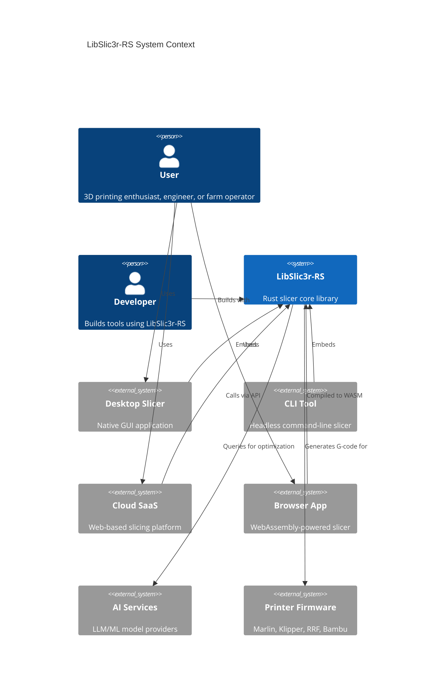
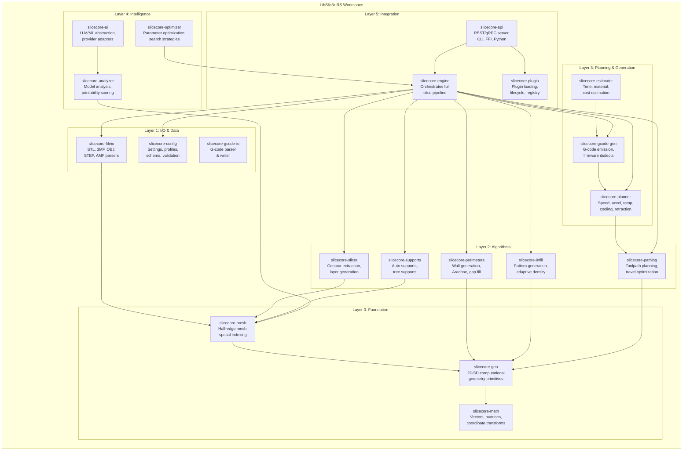
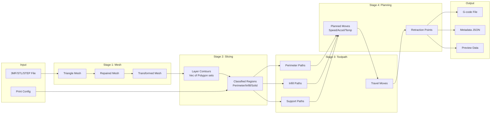
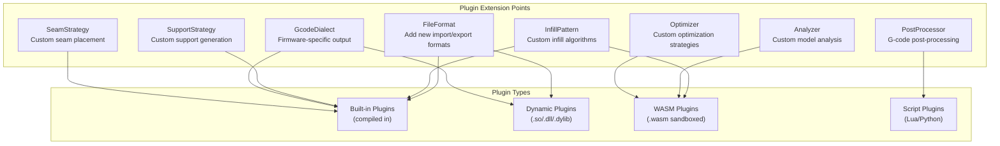
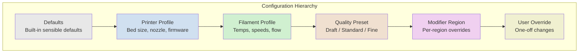
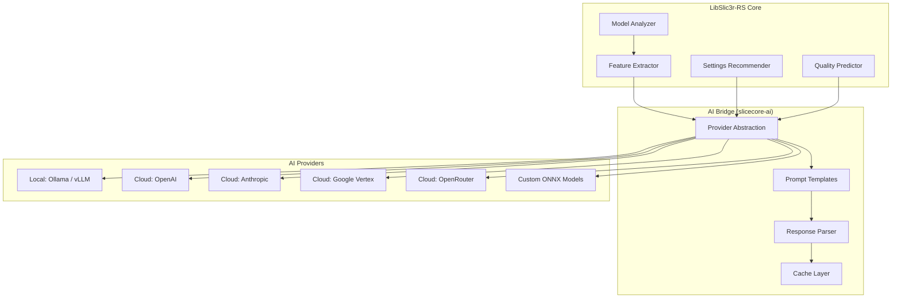

# LibSlic3r-RS: Architecture Design Document

**Version:** 1.0.0-draft
**Author:** Steve Scargall / SliceCore-RS Architecture Team
**Date:** 2026-02-13
**Status:** Draft — Review & Iterate

---

## 1. Architecture Philosophy

### 1.1 Core Principles

1. **Separation of Concerns:** Each module owns exactly one responsibility
2. **Data-Oriented Design:** Prefer flat arrays and SOA over deep object hierarchies
3. **Zero-Cost Abstractions:** Traits and generics over dynamic dispatch where performance matters
4. **Deterministic Execution:** Same inputs always produce identical outputs
5. **Progressive Complexity:** Simple things are simple; complex things are possible
6. **API-First:** Every capability is accessible programmatically before any UI exists
7. **Plugin-Friendly:** Core provides extension points; plugins provide implementations
8. **Memory-Efficient:** Streaming where possible; arena allocation for transient data

### 1.2 Why Not Wrap the C++ LibSlic3r?

| Approach | Pros | Cons |
|----------|------|------|
| FFI wrapper | Fast to market | Inherits all technical debt, unsafe boundaries everywhere, can't compile to WASM, build system nightmare |
| Incremental port | Lower risk | Two codebases to maintain, C++/Rust interop overhead, unclear migration path |
| **Clean rewrite** | **Clean architecture, WASM target, AI-friendly, modern tooling, sole-dev friendly** | **Higher upfront cost, risk of missing edge cases** |

**Decision: Clean rewrite.** The C++ codebase serves as a reference for algorithms and edge cases, but the architecture is designed from scratch.

---

## 2. High-Level Architecture

### 2.1 System Context



### 2.2 Container Diagram



---

## 3. Crate Architecture (Detailed)

### 3.1 Workspace Structure

```
slicecore-rs/
├── Cargo.toml                    # Workspace root
├── crates/
│   ├── slicecore-math/           # Layer 0: Math primitives
│   ├── slicecore-geo/            # Layer 0: Computational geometry
│   ├── slicecore-mesh/           # Layer 0: Mesh data structures
│   ├── slicecore-fileio/         # Layer 1: File format I/O
│   ├── slicecore-gcode-io/       # Layer 1: G-code I/O
│   ├── slicecore-config/         # Layer 1: Configuration system
│   ├── slicecore-slicer/         # Layer 2: Slicing algorithms
│   ├── slicecore-perimeters/     # Layer 2: Perimeter generation
│   ├── slicecore-infill/         # Layer 2: Infill generation
│   ├── slicecore-supports/       # Layer 2: Support generation
│   ├── slicecore-pathing/        # Layer 2: Toolpath planning
│   ├── slicecore-planner/        # Layer 3: Motion/thermal planning
│   ├── slicecore-gcode-gen/      # Layer 3: G-code generation
│   ├── slicecore-estimator/      # Layer 3: Time/material estimation
│   ├── slicecore-ai/             # Layer 4: AI/ML abstraction
│   ├── slicecore-optimizer/      # Layer 4: Parameter optimization
│   ├── slicecore-analyzer/       # Layer 4: Model analysis
│   ├── slicecore-engine/         # Layer 5: Pipeline orchestrator
│   ├── slicecore-plugin/         # Layer 5: Plugin system
│   └── slicecore-api/            # Layer 5: External interfaces
├── bins/
│   ├── slicecore-cli/            # CLI binary
│   └── slicecore-server/         # API server binary
├── plugins/
│   ├── infill-gyroid/            # Example: Gyroid infill plugin
│   └── gcode-klipper/            # Example: Klipper dialect plugin
├── benches/                      # Benchmarks
├── tests/                        # Integration tests
├── fuzz/                         # Fuzz testing targets
└── docs/                         # Architecture docs (this directory)
```

### 3.2 Crate Dependency Rules

```
Layer 5 (Integration)  →  can depend on  →  Layers 0-4
Layer 4 (Intelligence) →  can depend on  →  Layers 0-3
Layer 3 (Planning)     →  can depend on  →  Layers 0-2
Layer 2 (Algorithms)   →  can depend on  →  Layers 0-1
Layer 1 (I/O & Data)   →  can depend on  →  Layer 0
Layer 0 (Foundation)   →  no internal deps (only external crates)
```

**Rule: No upward dependencies. No circular dependencies. Enforced by `cargo deny`.**

---

## 4. Core Data Structures

### 4.1 Slicing Pipeline Data Flow



### 4.2 Key Types

```rust
// ===== Layer 0: Foundation Types =====

/// 3D point with f64 precision (micron-level accuracy at 1000mm scale)
#[derive(Clone, Copy, Debug, PartialEq)]
pub struct Point3 {
    pub x: f64,
    pub y: f64,
    pub z: f64,
}

/// 2D point for slice plane operations
#[derive(Clone, Copy, Debug, PartialEq)]
pub struct Point2 {
    pub x: f64,
    pub y: f64,
}

/// Internal coordinate type — integer for polygon operations (nanometer precision)
/// 1 mm = 1,000,000 internal units. Float64 only at API boundaries.
/// This matches the C++ Clipper approach and eliminates floating-point polygon bugs.
pub type Coord = i64;
pub const COORD_SCALE: f64 = 1_000_000.0;

/// 2D point using internal integer coordinates (for polygon operations)
#[derive(Clone, Copy, Debug, PartialEq, Eq, Hash)]
pub struct IPoint2 {
    pub x: Coord,
    pub y: Coord,
}

/// Axis-aligned bounding box
pub struct BBox3 {
    pub min: Point3,
    pub max: Point3,
}

// ===== Layer 0: Mesh Types =====

/// Indexed triangle mesh — the primary 3D representation
pub struct TriangleMesh {
    pub vertices: Vec<Point3>,
    pub indices: Vec<[u32; 3]>,     // Triangle vertex indices
    pub normals: Vec<Point3>,        // Per-face normals (computed lazily)
    pub aabb: BBox3,                 // Bounding box (cached)
    pub spatial_index: Option<BVH>,  // Bounding volume hierarchy
}

// ===== Layer 1: Geometry Types =====

/// Closed polygon (contour of a slice)
pub struct Polygon {
    pub points: Vec<Point2>,
    // Winding: CCW = outer, CW = hole
}

/// Collection of polygons at a single Z height
pub struct SliceLayer {
    pub z: f64,
    pub layer_height: f64,
    pub contours: Vec<Polygon>,     // Outer boundaries
    pub holes: Vec<Polygon>,        // Inner boundaries (holes)
}

/// Classified region within a layer
pub enum RegionType {
    Perimeter { wall_index: u32 },   // 0 = outermost
    TopSurface,
    BottomSurface,
    InternalSolid,
    Infill { density: f64 },
    Bridge,
    Overhang { angle: f64 },
    Support,
    SupportInterface,
    Ironing,                              // Top surface smoothing pass
    BridgeInternal,                       // Internal bridges (OrcaSlicer enhancement)
    GapFill,                              // Thin extrusions filling gaps
    SupportBase,                          // Support base material
    ThinWall,                             // Detected thin wall region
}

/// A single extrusion segment
pub struct ExtrusionSegment {
    pub start: Point2,
    pub end: Point2,
    pub width: f64,          // Extrusion width in mm
    pub height: f64,         // Layer height for this segment
    pub flow_rate: f64,      // mm³/s
    pub region: RegionType,
}

/// Complete toolpath for one layer
pub struct LayerToolpath {
    pub z: f64,
    pub segments: Vec<ExtrusionSegment>,
    pub travels: Vec<TravelMove>,
    pub retractions: Vec<Retraction>,
}

// ===== Layer 3: G-code Types =====

/// A planned move with all physical parameters resolved
pub struct PlannedMove {
    pub start: Point3,
    pub end: Point3,
    pub feedrate: f64,       // mm/s
    pub acceleration: f64,   // mm/s²
    pub extrusion: f64,      // mm of filament
    pub move_type: MoveType,
    pub temperature: Option<f64>,
    pub fan_speed: Option<u8>,   // 0-255
}

pub enum MoveType {
    Extrusion(RegionType),
    Travel,
    Retract,
    Unretract,
    Wipe,
    ZHop,
    Custom(String),
}
```

### 4.3 Arena Allocation Strategy

For slicing operations that produce large numbers of short-lived intermediate objects (e.g., polygon clipping during infill generation), we use arena allocation:

```rust
use bumpalo::Bump;

pub struct SlicingArena {
    arena: Bump,
}

impl SlicingArena {
    /// Allocate temporary polygons that live only during one layer's processing
    pub fn alloc_polygon(&self, points: &[Point2]) -> &[Point2] {
        self.arena.alloc_slice_copy(points)
    }

    /// Reset arena between layers — O(1) deallocation
    pub fn reset(&mut self) {
        self.arena.reset();
    }
}
```

---

## 5. Plugin Architecture

### 5.1 Extension Points



### 5.2 Plugin Trait Design

```rust
/// Every plugin implements this base trait
pub trait Plugin: Send + Sync {
    fn metadata(&self) -> PluginMetadata;
    fn init(&mut self, ctx: &PluginContext) -> Result<()>;
    fn shutdown(&mut self) -> Result<()>;
}

/// Extension point: Infill pattern generation
pub trait InfillPattern: Plugin {
    /// Generate infill paths for a region
    fn generate(
        &self,
        boundary: &[Polygon],
        config: &InfillConfig,
        layer: &LayerInfo,
    ) -> Result<Vec<ExtrusionSegment>>;

    /// Metadata for this pattern
    fn pattern_info(&self) -> PatternInfo;
}

/// Extension point: G-code dialect
pub trait GcodeDialect: Plugin {
    fn start_gcode(&self, config: &PrintConfig) -> String;
    fn end_gcode(&self, config: &PrintConfig) -> String;
    fn format_move(&self, mov: &PlannedMove) -> String;
    fn format_retraction(&self, retract: &Retraction) -> String;
    fn firmware_features(&self) -> FirmwareFeatures;
}

/// Extension point: Support generation strategy
pub trait SupportStrategy: Plugin {
    fn generate_supports(
        &self,
        mesh: &TriangleMesh,
        layers: &[SliceLayer],
        config: &SupportConfig,
    ) -> Result<Vec<SupportStructure>>;
}
```

### 5.3 WASM Plugin Sandboxing

WASM plugins run in a sandboxed runtime (Wasmtime) with:
- Memory limits (configurable, default 64 MiB)
- CPU time limits (configurable, default 30s per invocation)
- No filesystem access
- No network access
- Communication only through defined host functions

This enables a **plugin marketplace** where untrusted plugins can be safely loaded.

---

## 6. Configuration System

### 6.1 Hierarchical Configuration



### 6.2 Configuration Schema

All settings are defined declaratively in a schema that drives:
- Validation
- UI generation
- Documentation generation
- Profile serialization
- AI prompt generation

```rust
pub struct ConfigSchema {
    pub version: semver::Version,
    pub settings: IndexMap<SettingKey, SettingDefinition>,
    pub categories: Vec<Category>,
    pub presets: Vec<Preset>,
}

pub struct SettingDefinition {
    pub key: SettingKey,
    pub display_name: String,
    pub description: String,
    pub long_description: Option<String>,
    pub tier: Tier,                      // Auto, Simple, Intermediate, Advanced, Developer
    pub category: CategoryId,
    pub value_type: ValueType,
    pub default_value: Value,
    pub constraints: Vec<Constraint>,
    pub dependencies: Vec<Dependency>,   // "only active when X = Y"
    pub affects: Vec<SettingKey>,         // forward references
    pub units: Option<String>,
    pub tags: Vec<String>,
    pub since_version: semver::Version,
    pub deprecated: Option<String>,
}

pub enum ValueType {
    Bool,
    Int { min: i64, max: i64 },
    Float { min: f64, max: f64, precision: u8 },
    Enum { variants: Vec<EnumVariant> },
    String { pattern: Option<String> },
    Color,
    FloatVec { len: usize },            // e.g., [x, y, z] offsets
    Percent { min: f64, max: f64 },
}

pub enum Constraint {
    Range { min: Value, max: Value },
    MultipleOf(f64),
    DependsOn { key: SettingKey, condition: Condition },
    MutuallyExclusive(Vec<SettingKey>),
    Expression(String),                  // e.g., "layer_height <= nozzle_diameter * 0.8"
}
```

---

## 7. AI Integration Architecture

### 7.1 AI Abstraction Layer



### 7.2 AI Provider Trait

```rust
/// Provider-agnostic AI interface
#[async_trait]
pub trait AiProvider: Send + Sync {
    async fn complete(&self, request: CompletionRequest) -> Result<CompletionResponse>;
    async fn embed(&self, text: &str) -> Result<Vec<f32>>;
    fn capabilities(&self) -> ProviderCapabilities;
}

pub struct CompletionRequest {
    pub system_prompt: String,
    pub messages: Vec<Message>,
    pub temperature: f32,
    pub max_tokens: u32,
    pub response_format: Option<ResponseFormat>, // JSON schema for structured output
}

pub struct ProviderCapabilities {
    pub supports_vision: bool,
    pub supports_structured_output: bool,
    pub supports_embeddings: bool,
    pub max_context_tokens: u32,
    pub supports_streaming: bool,
}

/// Configuration for AI provider selection
pub struct AiConfig {
    pub provider: ProviderType,
    pub api_key: Option<SecretString>,   // User provides their own key
    pub base_url: Option<Url>,           // For self-hosted (Ollama, vLLM)
    pub model: String,
    pub timeout: Duration,
    pub cache_ttl: Duration,
}
```

### 7.3 AI Use Cases in Slicing

| Use Case | Input | Output | Model Type |
|----------|-------|--------|------------|
| Profile suggestion | Mesh features + printer + material | Recommended settings | LLM or fine-tuned classifier |
| Orientation optimization | Mesh geometry | Build plate orientation | Geometric ML model |
| Support placement | Mesh + overhang analysis | Support regions | LLM with vision or spatial model |
| Print failure prediction | Toolpath + settings | Risk score + explanations | Fine-tuned classifier |
| G-code explanation | G-code snippet | Natural language explanation | LLM |
| Setting explanation | Setting key + context | Plain English description | LLM |
| Troubleshooting | Print photo + settings | Diagnosis + fix suggestions | Vision LLM |

---

## 8. Concurrency Model

### 8.1 Parallelism Strategy

```mermaid
graph TB
    subgraph "Pipeline — matches C++ PrintObjectStep enum"
        S1["posSlice: Slice layers<br/>(parallel per-layer via rayon)"]
        S2["posPerimeters: Generate perimeters<br/>(parallel per-layer)"]
        S3["posPrepareInfill: Classify surfaces<br/>(parallel per-layer)"]
        S4["posInfill: Generate infill<br/>(parallel per-layer)"]
        S5["posIroning: Iron top surfaces<br/>(parallel per-layer)"]
        S6["posSupportSpotsSearch: Find support spots<br/>(parallel per-layer, nested)"]
        S7["posSupportMaterial: Generate supports<br/>(cross-layer + parallel)"]
        S8["posEstimateCurledExtrusions: Analyze curling<br/>(parallel per-layer)"]
        S9["posCalculateOverhangingPerimeters: Mark overhangs<br/>(parallel per-layer)"]
        S10["G-code Export: Emit G-code<br/>(sequential — ordered output)"]
    end

    S1 --> S2 --> S3 --> S4 --> S5 --> S6 --> S7 --> S8 --> S9 --> S10
```



### 8.2 Thread Pool Design

```rust
/// Slicing engine uses rayon for data parallelism
pub struct SliceEngine {
    thread_pool: rayon::ThreadPool,
    progress: Arc<dyn ProgressReporter>,
    cancel_token: CancellationToken,
}

impl SliceEngine {
    pub fn new(config: EngineConfig) -> Self {
        let pool = rayon::ThreadPoolBuilder::new()
            .num_threads(config.thread_count.unwrap_or_else(num_cpus::get))
            .thread_name(|i| format!("slice-worker-{}", i))
            .build()
            .expect("Failed to build thread pool");

        Self {
            thread_pool: pool,
            progress: config.progress_reporter,
            cancel_token: CancellationToken::new(),
        }
    }

    pub fn slice(&self, job: SliceJob) -> Result<SliceResult> {
        self.thread_pool.install(|| {
            let layers = self.slice_layers(&job)?;     // parallel
            let regions = self.classify_regions(&layers, &job)?;  // parallel
            let toolpaths = self.generate_toolpaths(&regions, &job)?; // parallel
            let planned = self.plan_motion(&toolpaths, &job)?;  // parallel
            let gcode = self.emit_gcode(&planned, &job)?;  // sequential
            Ok(SliceResult { gcode, metadata: self.compute_metadata(&planned) })
        })
    }
}
```

**C++ TBB Mapping:** The C++ LibSlic3r uses Intel TBB with 47+ `parallel_for` sites, 2 `parallel_reduce` operations, and task groups. In Rust, `rayon::par_iter()` maps directly to TBB's `parallel_for`, `rayon::join()` maps to `tbb::task_group`, and `par_iter().reduce()` maps to `tbb::parallel_reduce`. Key parallelized operations: mesh slicing, perimeter generation, infill generation, support generation (including nested parallelism in support spot detection), multi-material segmentation (8+ parallel loops), and mesh decimation.

### 8.3 Cancellation & Progress

```rust
/// Progress reporting for long-running operations
pub trait ProgressReporter: Send + Sync {
    fn report(&self, progress: Progress);
    fn is_cancelled(&self) -> bool;
}

pub struct Progress {
    pub stage: SliceStage,
    pub current: u64,
    pub total: u64,
    pub message: Option<String>,
    pub elapsed: Duration,
    pub estimated_remaining: Option<Duration>,
}

pub enum SliceStage {
    Loading,
    Repairing,
    Slicing,
    Perimeters,
    Infill,
    Supports,
    Pathing,
    Planning,
    GcodeGeneration,
    PostProcessing,
    Done,
}
```

---

## 9. WASM Architecture

### 9.1 WASM Compilation Strategy

```
┌─────────────────────────────────────────┐
│            Full Native Build            │
│  All crates, all features, full perf    │
├─────────────────────────────────────────┤
│            WASM Build (slim)            │
│  Core slicing only, no AI, no server    │
│  Feature flags: wasm-compat             │
│  Size target: < 5 MiB gzipped          │
├─────────────────────────────────────────┤
│  Excluded from WASM:                    │
│  - slicecore-ai (network-dependent)     │
│  - slicecore-api (server features)      │
│  - slicecore-plugin (dynamic loading)   │
│  - File system operations               │
└─────────────────────────────────────────┘
```

### 9.2 WASM Interface

```rust
#[cfg(target_arch = "wasm32")]
#[wasm_bindgen]
pub struct WasmSlicer {
    engine: SliceEngine,
}

#[cfg(target_arch = "wasm32")]
#[wasm_bindgen]
impl WasmSlicer {
    #[wasm_bindgen(constructor)]
    pub fn new() -> Self { /* ... */ }

    /// Slice from raw bytes (STL or 3MF)
    pub fn slice(&self, model_bytes: &[u8], config_json: &str) -> Result<JsValue, JsError> {
        // Returns { gcode: string, metadata: object, preview: object }
    }

    /// Get slicing progress (0.0 - 1.0)
    pub fn progress(&self) -> f64 { /* ... */ }

    /// Cancel current operation
    pub fn cancel(&self) { /* ... */ }
}
```

---

## 10. Error Handling Strategy

### 10.1 Error Types

```rust
/// Top-level error type using thiserror
#[derive(Debug, thiserror::Error)]
pub enum SliceCoreError {
    #[error("Mesh error: {0}")]
    Mesh(#[from] MeshError),

    #[error("Slicing error at layer {layer}: {message}")]
    Slicing { layer: u32, message: String },

    #[error("Configuration error: {0}")]
    Config(#[from] ConfigError),

    #[error("I/O error: {0}")]
    Io(#[from] std::io::Error),

    #[error("Plugin error in '{plugin}': {message}")]
    Plugin { plugin: String, message: String },

    #[error("Operation cancelled")]
    Cancelled,

    #[error("AI provider error: {0}")]
    Ai(#[from] AiError),
}

/// Mesh-specific errors with repair suggestions
#[derive(Debug, thiserror::Error)]
pub enum MeshError {
    #[error("Non-manifold edge at vertices {v1}-{v2}; auto-repair available")]
    NonManifold { v1: u32, v2: u32 },

    #[error("Self-intersecting faces {f1} and {f2}")]
    SelfIntersection { f1: u32, f2: u32 },

    #[error("Degenerate triangle at face {face} (zero area)")]
    DegenerateTriangle { face: u32 },

    #[error("Mesh has {count} disconnected components")]
    DisconnectedComponents { count: u32 },
}
```

### 10.2 Warning System

Not all issues are errors — many are warnings that should be reported but not halt slicing:

```rust
pub struct SliceWarning {
    pub severity: WarningSeverity,
    pub category: WarningCategory,
    pub message: String,
    pub location: Option<WarningLocation>,
    pub suggestion: Option<String>,
}

pub enum WarningSeverity {
    Info,       // "Using adaptive layer heights"
    Advisory,   // "Overhang detected at 52°, consider supports"
    Warning,    // "Bridge span of 35mm may sag"
    Critical,   // "Thin wall below minimum extrusion width"
}
```

---

## 11. Testing Strategy

### 11.1 Test Pyramid

```
          ┌───────────┐
          │  E2E Tests │  CLI: slice known model, compare G-code hash
          │   (~20)    │
          ├───────────┤
          │Integration │  Multi-crate: full pipeline on test models
          │  (~100)    │
          ├───────────┤
          │ Unit Tests │  Per-crate: algorithms, parsers, transforms
          │  (~2000+)  │
          └───────────┘

     + Fuzz Tests: All parsers (STL, 3MF, G-code, config)
     + Property Tests: Geometric invariants (proptest)
     + Benchmark Suite: Performance regression detection
     + Golden File Tests: Deterministic output verification
```

### 11.2 Golden File Testing

```rust
#[test]
fn slice_calibration_cube() {
    let mesh = load_test_model("calibration_cube_20mm.stl");
    let config = load_test_config("standard_pla.toml");
    let result = slice(&mesh, &config).unwrap();

    // Deterministic output — G-code must match golden file exactly
    assert_eq!(
        sha256(&result.gcode),
        include_str!("golden/calibration_cube_20mm_standard_pla.sha256").trim()
    );
}
```

---

## 12. Security Considerations

| Concern | Mitigation |
|---------|------------|
| Malicious model files (fuzzing attack surface) | All parsers fuzz-tested; no `unsafe` in parsers |
| Plugin sandbox escape | WASM plugins via Wasmtime with resource limits |
| API key exposure | `secrecy` crate; keys never logged or serialized |
| G-code injection (malicious custom G-code) | Sanitize user-provided G-code snippets |
| Denial of service (huge models) | Configurable limits on vertex count, layer count, memory |
| Supply chain attacks | `cargo deny` for license + advisory checks; minimal dependencies |

---

## 13. What's Missing from Existing Slicers That We Must Include

### 13.1 Critical Gaps Addressed

| Gap | Current State | LibSlic3r-RS Solution |
|-----|--------------|----------------------|
| **Deterministic output** | C++ slicers produce different G-code across runs due to floating-point non-determinism | Deterministic algorithms + canonical ordering |
| **Structured metadata output** | Slicers output only G-code + embedded comments | JSON/MessagePack metadata alongside G-code |
| **Embeddable library** | Can't use slicing as a library call | `slicecore-engine` is a pure Rust library |
| **Streaming G-code** | Must wait for full slice to complete | Stream layers as they complete |
| **Profile diffing** | No way to see what changed between profiles | Built-in profile diff/merge |
| **Simulation hooks** | No way to predict print quality | Analyzers produce risk scores per feature |
| **Multi-architecture builds** | C++ cross-compilation is painful | Rust cross-compilation is straightforward |
| **Reproducible builds** | Build-to-build output varies | Deterministic + lockfile-pinned deps |

### 13.2 Novel/Patentable Ideas to Explore

1. **Predictive Layer Adhesion Scoring** — Score each layer transition for adhesion risk based on geometry, cooling, and speed; auto-adjust parameters for risky layers
2. **Topology-Aware Adaptive Infill** — FEA-lite: vary infill density based on load paths inferred from geometry (bolt holes, cantilevers, thin walls)
3. **AI Seam Negotiation** — Use vision models to hide seams along natural edges and texture boundaries
4. **Cross-Layer Path Continuity Optimization** — Minimize total travel distance across layers, not just within layers
5. **Thermal History Simulation** — Model heat accumulation across layers to predict warping and adjust cooling dynamically
6. **G-code Streaming Protocol** — Stream G-code layers to a printer as they're generated; start printing before slicing finishes
7. **Collaborative Profiles** — Git-like branching/merging for print profiles with conflict resolution
8. **Scarf Joint Seam System** — Gradient flow/speed transition at seam start/end instead of sharp join, dramatically reducing seam visibility. OrcaSlicer pioneered this with 12 configurable parameters.
9. **Adaptive Pressure Advance** — Dynamic PA adjustment based on instantaneous flow rate and acceleration, reducing bulging on slow features and gaps on fast features.
10. **Per-Feature Flow Ratio System** — 10+ independent flow multipliers for each extrusion type (outer wall, inner wall, overhang, gap fill, etc.) enabling fine-grained material optimization.

---

*Next Document: [03-API-DESIGN.md](./03-API-DESIGN.md)*