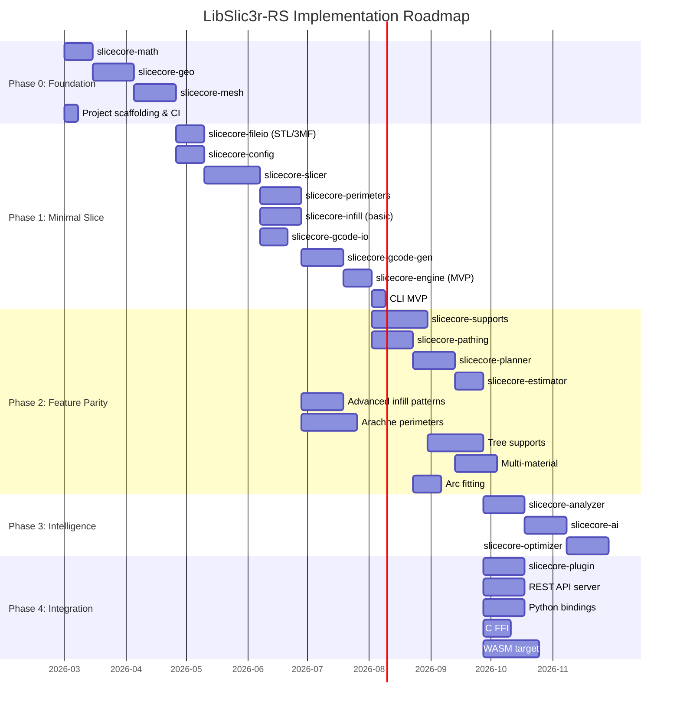

# LibSlic3r-RS: Implementation Guide

**Version:** 1.0.0-draft
**Author:** Steve Scargall / SliceCore-RS Architecture Team
**Date:** 2026-02-13
**Status:** Draft — Review & Iterate

---

## 1. Implementation Philosophy

### 1.1 Sole Developer Strategy

As a solo developer with AI coding assists, the implementation follows these principles:

1. **Vertical slices over horizontal layers** — Get a minimal end-to-end pipeline working first, then widen
2. **Tests before complexity** — Write golden-file tests early; they catch regressions as algorithms evolve
3. **Crate boundaries enforce discipline** — Small, focused crates keep cognitive load manageable
4. **AI-assist friendly code** — Clear types, descriptive names, minimal macros, comprehensive doc comments
5. **Progressive enhancement** — Ship a working CLI before adding AI, plugins, or cloud features
6. **Reference implementation guided** — Use C++ LibSlic3r as an algorithm reference, not as architecture

### 1.2 Development Toolchain

| Tool | Purpose |
|------|---------|
| `cargo` | Build, test, bench |
| `cargo-watch` | Auto-rebuild on save |
| `cargo-nextest` | Faster test runner |
| `cargo-tarpaulin` | Coverage measurement |
| `cargo-deny` | License + advisory audit |
| `cargo-fuzz` | Fuzz testing |
| `cargo-flamegraph` | Performance profiling |
| `criterion` | Benchmarking |
| `proptest` | Property-based testing |
| `miri` | Undefined behavior detection |
| `clippy` | Lint enforcement |
| `rustfmt` | Code formatting |
| Claude Code / AI | Pair programming |

---

## 2. Phased Implementation Roadmap

### 2.1 Phase Overview



---

## 3. Phase 0: Foundation (Weeks 1–8)

**Goal:** Solid math, geometry, and mesh primitives with comprehensive tests.

### 3.1 Milestone 0.1 — `slicecore-math`

| Task | Details | Tests |
|------|---------|-------|
| Point2, Point3 types | `f64`, `Copy`, `serde`, `PartialEq` with epsilon | Arithmetic, equality with tolerance |
| Vec2, Vec3 types | Normalize, dot, cross, length, angle_between | Property: `|normalize(v)| == 1.0` |
| Matrix3x3, Matrix4x4 | Affine transforms, rotation, scale | Inverse round-trip: `M * M⁻¹ ≈ I` |
| BBox2, BBox3 | Union, intersection, contains, expand | Containment after union |
| Coordinate conventions | Z-up, right-handed, mm units | Documented, not just assumed |
| Epsilon utilities | `approx_eq(a, b, eps)`, configurable tolerance | Edge cases near zero |
| Unit conversions | mm ↔ inches ↔ microns | Round-trip accuracy |

**Key Design Decisions:**
- `f64` everywhere — precision matters at micron scale over 300mm build volumes
- No external math library at this level; `nalgebra` optional via feature flag in higher layers
- `#[repr(C)]` on primitives for FFI compatibility
- `#[cfg(feature = "wasm")]` stubs where platform divergence exists

### 3.2 Milestone 0.2 — `slicecore-geo`

| Task | Details | Algorithm |
|------|---------|-----------|
| Polygon type | Closed, oriented, area/winding, hole tracking | Shoelace for area |
| Polyline type | Open path with length computation | — |
| Boolean operations | Union, intersection, difference, XOR | Martinez-Rueda or Vatti |
| Polygon offsetting | Inward/outward by distance | Minkowski sum / Clipper-style |
| Line intersection | Segment-segment, ray-segment | Parametric intersection |
| Point-in-polygon | Robust winding number test | Winding number (not ray cast) |
| Simplification | Reduce point count preserving shape | Ramer-Douglas-Peucker |
| Voronoi / medial axis | For Arachne variable-width perimeters | Fortune's algorithm |
| Convex hull | 2D convex hull | Graham scan |

**Critical Note — Polygon Clipping Performance:**
Polygon clipping is the most performance-critical geometry operation in the entire slicer. The C++ LibSlic3r has **1,425+ Clipper call sites across 34+ files**, with `ClipperUtils.cpp` alone being 1,031+ lines. The C++ code uses integer coordinates internally (nanometer precision) for robustness. Options:

1. **`i-overlay` crate** — Modern Rust polygon clipping with integer coordinate support, worth benchmarking first
2. **Port Clipper2 to Rust** — Known-good algorithm, significant effort (~1,000+ LOC wrapper needed)
3. **`geo` crate boolean ops** — Good API but uses floating-point; may have robustness issues at scale
4. **Write a new implementation** — Opportunity for innovation; must match Clipper's robustness with integer math

**Recommendation:** Benchmark `i-overlay` first (it uses integer coordinates matching our approach). The C++ codebase relies on specific Clipper behaviors including safety offsets (`ClipperSafetyOffset = 10.f`), optimized `_clipped()` variants using bounding box pre-checks, and `union_parallel_reduce()` for merging large polygon sets. Our implementation must match these patterns.

**Key Clipper operations to support (by frequency):**
- `offset()` / `expand()` / `shrink()` — Polygon offsetting (most frequent, used in perimeter generation)
- `diff()` / `diff_ex()` — Difference operations (infill region computation)
- `union_()` / `union_safety_offset()` — Union with numerical safety
- `intersection()` — Region intersection (surface classification)
- `offset2()` — Two-stage offset (thin wall detection)

### 3.3 Milestone 0.3 — `slicecore-mesh`

| Task | Details |
|------|---------|
| TriangleMesh | Indexed vertices + face indices, lazy normals, cached AABB |
| BVH construction | SAH-based bounding volume hierarchy for fast ray/plane queries |
| Mesh repair | Non-manifold detection, hole filling, degenerate removal, winding fix |
| Mesh transforms | Translate, rotate, scale, mirror, align-to-bed, center-on-bed |
| Spatial queries | Closest point on mesh, point containment, ray intersection |
| Mesh statistics | Volume, surface area, triangle count, is-manifold, is-watertight |
| Connected components | Identify separate bodies within a single mesh |

**Arena Allocation for Intermediate Geometry:**

```rust
use bumpalo::Bump;

/// Per-layer arena: allocated once, reset between layers
/// Avoids millions of small allocations during clipping operations
pub struct LayerArena {
    bump: Bump,
}

impl LayerArena {
    pub fn new() -> Self {
        Self { bump: Bump::with_capacity(1024 * 1024) } // 1 MiB initial
    }
    pub fn reset(&mut self) { self.bump.reset(); }
    pub fn alloc_slice<T: Copy>(&self, src: &[T]) -> &[T] {
        self.bump.alloc_slice_copy(src)
    }
}
```

---

## 4. Phase 1: Minimal Viable Slice (Weeks 9–24)

**Goal:** Slice a simple STL → working G-code that prints on a Marlin printer.

**Success Criterion:** Print a 20mm calibration cube from STL input using CLI.

### 4.1 Milestone 1.1 — `slicecore-fileio`

| Task | Details |
|------|---------|
| STL binary parser | Read binary STL, extract triangles, validate header |
| STL ASCII parser | Read ASCII STL, handle malformed whitespace |
| 3MF integration | Use `lib3mf-core` for 3MF reading (already implemented) |
| OBJ parser | Basic Wavefront OBJ (vertices + faces only) |
| Format detection | Magic-byte sniffing: `solid` → ASCII STL, 3MF zip signature, etc. |
| Export: STL binary | Write repaired mesh back to STL |
| Fuzz targets | All parsers get `cargo-fuzz` targets |

### 4.2 Milestone 1.2 — `slicecore-config`

| Task | Details |
|------|---------|
| Schema definition | TOML-defined schema for ~850 unique settings (538 PrusaSlicer base + innovations from OrcaSlicer, BambuStudio, CrealityPrint) |
| TOML parser | Load printer/filament/quality TOML configs |
| Validation | Type checks, range checks, dependency checks |
| Profile hierarchy | Defaults → Printer → Filament → Quality → User overrides |
| Setting metadata | Tier, category, units, description, affects/affected_by |
| Legacy import | Parse PrusaSlicer/OrcaSlicer `.ini` profiles |
| JSON Schema export | For API consumers and UI generation |
| Profile diff | Compare two profiles, list differences |

**Settings Schema Snippet (declarative):**

```toml
# schema/perimeters.toml
[perimeters.wall_count]
display_name = "Wall Count"
description = "Number of perimeter walls to generate"
type = "int"
default = 2
min = 1
max = 20
tier = "simple"
category = "perimeters"
units = "walls"
tags = ["strength", "surface_quality"]
affects = ["perimeters.thin_wall_detection"]

[perimeters.outer_wall_speed]
display_name = "Outer Wall Speed"
description = "Print speed for the outermost perimeter wall"
type = "float"
default = 150.0
min = 5.0
max = 600.0
tier = "intermediate"
category = "speed"
units = "mm/s"
tags = ["speed", "surface_quality"]
```

### 4.3 Milestone 1.3 — `slicecore-slicer` (THE CORE)

This is the most critical crate. It transforms a 3D mesh into 2D layer contours.

**Algorithm: Contour Extraction**

```
INPUT:  TriangleMesh + layer_heights[]
OUTPUT: Vec<SliceLayer> where each layer has contours + holes

ALGORITHM (per-layer, parallelizable with rayon):

1. SORT triangles by Z-range into buckets (preprocessing, O(n))
   - For each triangle, compute z_min, z_max
   - Insert into interval tree or sorted list

2. FOR EACH layer at height Z (parallel via rayon::par_iter):
   a. QUERY triangles overlapping Z (interval tree lookup, O(log n + k))

   b. FOR EACH intersecting triangle:
      - Compute intersection of triangle plane with Z-plane
      - Result: line segment (two points) or degenerate (point/nothing)
      - Store segment with consistent orientation (CCW from above)

   c. CHAIN segments into closed contours:
      - Build endpoint → segment lookup table (HashMap)
      - Start at arbitrary unvisited segment
      - Walk chain: current_endpoint → find next segment sharing endpoint
      - Continue until chain closes (within epsilon tolerance)
      - Handle T-junctions and near-miss endpoints

   d. CLASSIFY contours:
      - Compute signed area (Shoelace formula)
      - Positive area → outer boundary (CCW)
      - Negative area → hole (CW)

   e. ASSOCIATE holes with parents:
      - For each hole, test if centroid is inside each outer contour
      - Use winding-number point-in-polygon test

   f. SIMPLIFY contours:
      - Remove collinear points (within angle tolerance)
      - Apply RDP simplification if enabled

3. RETURN Vec<SliceLayer>
```

**C++ Pipeline Mapping:**
The C++ `PrintObject::slice()` function corresponds to `posSlice` in the 9-step pipeline:
1. `posSlice` — Mesh → Layer contours (this milestone)
2. `posPerimeters` — Layer contours → Perimeter paths
3. `posPrepareInfill` — Surface type classification
4. `posInfill` — Infill pattern generation
5. `posIroning` — Top surface ironing
6. `posSupportSpotsSearch` — Support spot detection
7. `posSupportMaterial` — Full support generation
8. `posEstimateCurledExtrusions` — Curl/overhang estimation
9. `posCalculateOverhangingPerimeters` — Overhang perimeter marking

Each step is independently parallelized via TBB in C++ (maps to rayon in Rust).
Steps 1-5 are per-layer parallel; steps 6-7 have cross-layer dependencies.

**Adaptive Layer Heights:**

```
INPUT:  TriangleMesh + min_height, max_height, quality_factor
OUTPUT: Vec<f64> — non-uniform layer Z heights

ALGORITHM:
1. Compute surface curvature at each Z:
   - Sample normals of triangles at each candidate height
   - High curvature (normals changing rapidly) → thin layers
   - Low curvature (flat/vertical) → thick layers

2. Dynamic programming to optimize layer heights:
   - Minimize total deviation from true surface
   - Subject to min_height ≤ h ≤ max_height constraint
   - Subject to max layer height change between adjacent layers

3. Result: variable heights like [0.20, 0.20, 0.12, 0.08, 0.08, 0.12, 0.20, ...]
```

### 4.4 Milestone 1.4 — `slicecore-perimeters`

| Task | Algorithm/Approach |
|------|--------------------|
| Basic perimeter generation | Inward offset of contour by `nozzle_width/2`, repeated N times |
| Gap fill | Detect gaps between innermost perimeter and infill region; fill with thin extrusions |
| Thin wall detection | Medial axis of regions narrower than `2 × nozzle_width` |
| Seam placement: nearest | Minimize distance from previous layer's seam point |
| Seam placement: aligned | Project seam position vertically through layers |
| Seam placement: sharpest corner | Score corners by angle; place seam at sharpest concave corner |
| Seam placement: random | Deterministic pseudo-random based on layer index |
| Wall ordering: inner-first | Print inner walls, then outer (better overhang support) |
| Wall ordering: outer-first | Print outer wall first (better surface finish) |
| Wall ordering: inner-outer-inner | Arachne-style sandwich for best of both |

### 4.5 Milestone 1.5 — `slicecore-infill` (Basic Patterns)

| Pattern | Description | Use Case |
|---------|-------------|----------|
| Rectilinear | Parallel lines, alternating angle per layer | General purpose |
| Grid | Perpendicular lines forming squares | General purpose |
| Triangles | Three-direction lines forming triangles | Strength |
| Concentric | Inward offsets of boundary | Flexible parts |
| Lines | Parallel lines, same angle every layer | Top/bottom fill |
| Monotonic | Lines printed in one direction (no crossing) | Top surfaces |

**Infill Generation Algorithm (per-layer, per-region):**

```
INPUT:  boundary_polygons[], infill_config
OUTPUT: Vec<ExtrusionSegment>

1. COMPUTE infill region:
   - Start with layer contour
   - Subtract all perimeter regions (inward offset by wall_count × width)
   - Result: the "infillable" area

2. GENERATE fill lines:
   - For rectilinear: parallel lines at angle, spaced by line_spacing
   - Clip fill lines against infill region polygons
   - Result: set of line segments within the region

3. CONNECT segments:
   - Optimize travel between segments (nearest-neighbor greedy)
   - Where possible, connect adjacent segments to reduce retractions
   - Apply anchor_length at segment starts for adhesion

4. CONVERT to ExtrusionSegments:
   - Assign width = infill_extrusion_width
   - Assign flow_rate based on layer_height, width, speed
```

### 4.6 Milestone 1.6 — `slicecore-gcode-io`

| Task | Details |
|------|---------|
| G-code parser | Tokenize G-code lines into structured `GcodeLine` enum |
| Move extraction | Parse G0/G1/G2/G3 into structured move objects |
| Metadata parsing | Extract slicer comments, layer markers, thumbnails |
| G-code writer | Format `PlannedMove` into G-code strings |
| Firmware dialects | Marlin, Klipper, RepRapFirmware, Bambu header/footer |

### 4.7 Milestone 1.7 — `slicecore-gcode-gen`

| Task | Details |
|------|---------|
| Move sequencing | Order extrusion segments into print sequence per layer |
| Travel moves | Generate travel moves between extrusion endpoints |
| Retraction insertion | Add retract/unretract based on travel distance |
| Z-hop | Lift nozzle during travels over printed areas |
| Wipe moves | Pre-retraction wipe along last extrusion |
| Start/end G-code | Firmware-specific initialization and shutdown |
| Layer change | Z movement, per-layer G-code hooks |
| Speed assignment | Map RegionType → configured speed |
| Extrusion calculation | Compute E-axis values from flow rate and move length |
| Comments | Optional: annotate G-code with region type, object labels |

### 4.8 Milestone 1.8 — `slicecore-engine` (MVP)

The engine orchestrates the full pipeline:

```rust
pub struct Engine { /* thread pool, config, plugins */ }

impl Engine {
    pub fn slice(&self, job: SliceJob) -> Result<SliceResult> {
        // 1. Load model
        let mesh = self.load_model(&job)?;
        // 2. Repair if needed
        let mesh = self.repair_mesh(mesh)?;
        // 3. Apply transforms
        let mesh = self.transform_mesh(mesh, &job.config)?;
        // 4. Compute layer heights
        let heights = self.compute_layer_heights(&mesh, &job.config)?;
        // 5. Slice to contours (parallel)
        let layers = self.slice_layers(&mesh, &heights)?;
        // 6. Generate perimeters (parallel per-layer)
        let perimeters = self.generate_perimeters(&layers, &job.config)?;
        // 7. Generate infill (parallel per-layer)
        let infill = self.generate_infill(&layers, &perimeters, &job.config)?;
        // 8. Merge toolpaths
        let toolpaths = self.merge_toolpaths(&perimeters, &infill)?;
        // 9. Generate G-code
        let gcode = self.generate_gcode(&toolpaths, &job.config)?;
        // 10. Compute metadata
        let metadata = self.compute_metadata(&gcode, &job.config)?;

        Ok(SliceResult { gcode, metadata, warnings: self.collect_warnings() })
    }
}
```

### 4.9 Milestone 1.9 — CLI MVP

```bash
# The MVP CLI — minimal but functional
slicecore slice model.stl -o output.gcode
slicecore slice model.stl --config pla.toml -o output.gcode
slicecore slice model.stl --set layer_height=0.2 --set infill.density=0.15 -o out.gcode
slicecore analyze model.stl --json
slicecore version
```

**Phase 1 Complete Deliverable:** A CLI that can slice simple models to printable G-code.

---

## 5. Phase 2: Feature Parity (Weeks 25–48)

**Goal:** Match 90% of OrcaSlicer/PrusaSlicer slicing capability.

### 5.1 `slicecore-supports`

| Task | Description |
|------|-------------|
| Overhang detection | Identify faces exceeding support angle threshold |
| Basic support generation | Grid/line supports under overhangs |
| Support interface layers | Dense layers at support-model contact |
| Support-model gap | Z and XY distance for easy removal |
| Tree supports | Organic branching supports (research: SDF-based tree generation) |
| Support enforcers/blockers | User-defined regions to force/prevent supports |
| Support roof/floor | Smooth interface for better surface quality |

**Tree Support — Three Implementations Found in C++:**

1. **PrusaSlicer Organic (Influence-Area Based):**
   - ~3,660 lines (TreeSupport.cpp + OrganicSupport.cpp)
   - Top-down: overhang → branch → trunk → bed
   - Uses `TreeModelVolumes` for collision/avoidance caching
   - Influence area expansion with incremental polygon offset
   - Generates 3D mesh, then slices it (unique approach)

2. **OrcaSlicer Node-Graph:**
   - Graph-based node structure with parent/child relationships
   - Bottom-up merging with spatial proximity detection
   - Polygon node enhancement for better bed contact

3. **BambuStudio Integrated:**
   - Hybrid approach with slim/strong/hybrid style variants
   - Support ironing for top surface quality
   - Sharp tail handling for thin features

**Recommended approach for LibSlic3r-RS:**
Start with the PrusaSlicer influence-area algorithm (best documented), then add polygon node enhancement from OrcaSlicer/Bambu as P2.

### 5.2 `slicecore-pathing`

| Task | Description |
|------|-------------|
| Travel optimization | TSP-approximate: minimize total travel distance per layer |
| Crossing avoidance | Route travels around printed regions to avoid stringing |
| Object ordering | For sequential printing: order objects to avoid collisions |
| Seam alignment across layers | Global seam path optimization (not just per-layer) |
| Arc fitting (G2/G3) | Fit arcs to curved segments to reduce G-code size and improve quality |

**Travel Optimization — Novel Approach:**

```
Traditional: Greedy nearest-neighbor for next extrusion start
Proposed:    Layer-aware 2-opt with thermal history

1. Initial solution: nearest-neighbor ordering of extrusion groups
2. 2-opt improvement: try swapping pairs, accept if total
   (travel_distance + cooling_penalty) improves
3. Cooling penalty: penalize returning to a recently-printed area
   (thermal model estimates if material is still hot)
4. Result: paths that both minimize travel AND allow cooling
```

### 5.3 `slicecore-planner`

| Task | Description |
|------|-------------|
| Speed planning | Assign speeds per move based on region type + constraints |
| Acceleration planning | Trapezoidal velocity profiles, junction deviation |
| Minimum layer time | Slow down if layer prints too fast (cooling) |
| Fan speed planning | Layer-time based fan ramping, bridge fan boost |
| Temperature changes | Standby temps for idle tools, first-layer overrides |
| Pressure advance compensation | Pre-compensate for PA in extrusion calculations |
| Volumetric flow limiting | Cap speed based on max volumetric flow for hotend |

### 5.4 `slicecore-estimator`

| Task | Description |
|------|-------------|
| Print time estimation | Simulate firmware motion planner for accurate times |
| Filament length/weight | Sum extrusion lengths, convert via density |
| Cost estimation | Filament cost per gram × weight |
| Per-layer time breakdown | Time per layer for UI progress bars |
| Per-feature time breakdown | How much time spent on infill vs perimeters vs travel |

### 5.5 Advanced Features

| Feature | Crate | Description |
|---------|-------|-------------|
| Arachne perimeters | `slicecore-perimeters` | Variable-width walls via medial axis |
| Gyroid infill | `slicecore-infill` | TPMS-based pattern with excellent strength/weight |
| Lightning infill | `slicecore-infill` | Tree-like infill only where needed to support top surfaces |
| Cubic infill | `slicecore-infill` | 3D interlocking cubes |
| Honeycomb infill | `slicecore-infill` | Classic hexagonal pattern |
| Adaptive cubic | `slicecore-infill` | Denser near surfaces, sparser inside |
| Ironing | `slicecore-perimeters` | Final smoothing pass on top surfaces |
| Multi-material | `slicecore-engine` | Tool changes, purge tower generation |
| Sequential printing | `slicecore-engine` | Print objects one-at-a-time with collision checks |
| Paint-on supports | `slicecore-supports` | Mesh modifier regions for support placement |
| Fuzzy skin | `slicecore-perimeters` | Random displacement of outer wall for texture |
| Scarf seam | `slicecore-pathing` | Gradient flow/speed transition at seam (12 OrcaSlicer settings) |
| Per-feature flow | `slicecore-planner` | 10+ independent flow ratios (Orca: outer wall, inner, overhang, gap fill, etc.) |
| 4-tier overhang | `slicecore-planner` | Dynamic speed/fan by overhang angle (0-25%, 25-50%, 50-75%, 75%+) |
| Wall direction | `slicecore-perimeters` | Configurable inner/outer wall print direction |
| Brim ears | `slicecore-gcode-gen` | Mouse ears at corners for small part adhesion |
| Hole-to-polyhole | `slicecore-perimeters` | Convert circles to polygons for dimensional accuracy |

---

## 6. Phase 3: Intelligence (Weeks 49–60)

### 6.1 `slicecore-analyzer`

Extract structured features from meshes for AI consumption:

```rust
pub struct AnalysisReport {
    pub geometry: GeometryFeatures,
    pub printability: PrintabilityAssessment,
    pub features: DetectedFeatures,
    pub suggested_orientation: Option<Orientation>,
    pub complexity_score: f64,  // 0.0 (trivial) to 1.0 (extremely complex)
}

pub struct GeometryFeatures {
    pub bounding_box: BBox3,
    pub volume_cm3: f64,
    pub surface_area_cm2: f64,
    pub triangle_count: u32,
    pub vertex_count: u32,
    pub is_manifold: bool,
    pub is_watertight: bool,
    pub genus: u32,                    // Topological genus (holes through solid)
    pub connected_components: u32,
    pub aspect_ratio: f64,             // Longest / shortest dimension
    pub center_of_mass: Point3,
}

pub struct DetectedFeatures {
    pub overhangs: Vec<OverhangRegion>,
    pub bridges: Vec<BridgeSpan>,
    pub thin_walls: Vec<ThinWallRegion>,
    pub holes: Vec<HoleFeature>,       // Bolt holes, through-holes
    pub flat_surfaces: Vec<FlatSurface>,
    pub curved_surfaces: Vec<CurvedRegion>,
    pub sharp_edges: Vec<SharpEdge>,
    pub cantilevers: Vec<Cantilever>,
    pub text_regions: Vec<TextRegion>,  // Embossed/engraved text detection
}
```

### 6.2 `slicecore-ai`

Provider-agnostic AI abstraction:

```rust
#[async_trait]
pub trait AiProvider: Send + Sync {
    async fn complete(&self, req: CompletionRequest) -> Result<CompletionResponse>;
    async fn embed(&self, text: &str) -> Result<Vec<f32>>;
    fn capabilities(&self) -> ProviderCapabilities;
}

// Built-in providers:
pub struct OllamaProvider { base_url: Url, model: String }
pub struct VllmProvider { base_url: Url, model: String }
pub struct OpenAiProvider { api_key: SecretString, model: String }
pub struct AnthropicProvider { api_key: SecretString, model: String }
pub struct GoogleVertexProvider { credentials: GoogleCredentials, model: String }
pub struct OpenRouterProvider { api_key: SecretString, model: String }
pub struct OnnxLocalProvider { model_path: PathBuf }  // For local ML models
```

### 6.3 `slicecore-optimizer`

```rust
pub struct OptimizationRequest {
    pub model_analysis: AnalysisReport,
    pub printer: PrinterProfile,
    pub material: MaterialProfile,
    pub goal: OptimizationGoal,
}

pub enum OptimizationGoal {
    Speed,           // Minimize print time
    Quality,         // Maximize surface quality
    Strength,        // Maximize part strength
    MinMaterial,     // Minimize filament usage
    Balanced,        // Weighted combination
    Custom(Vec<(GoalAxis, f64)>), // User-defined weights
}

pub struct OptimizationResult {
    pub config: PrintConfig,
    pub reasoning: String,          // Human-readable explanation
    pub confidence: f64,            // 0.0 to 1.0
    pub tradeoffs: Vec<Tradeoff>,   // What was sacrificed for the goal
    pub estimated_time: Duration,
    pub estimated_material_g: f64,
}
```

---

## 7. Phase 4: Integration (Weeks 49–64, parallel with Phase 3)

### 7.1 `slicecore-plugin`

| Component | Details |
|-----------|---------|
| Plugin registry | Discover and load plugins at runtime |
| Built-in plugins | Compiled into the binary (infill patterns, G-code dialects) |
| Dynamic plugins | `.so` / `.dll` / `.dylib` loaded at runtime |
| WASM plugins | Sandboxed via Wasmtime, resource-limited |
| Plugin API versioning | Semver-based compatibility checking |
| Plugin manifest | TOML file describing plugin metadata and capabilities |

**Plugin manifest format:**

```toml
# plugin.toml
[plugin]
name = "gyroid-infill-v2"
version = "1.0.0"
description = "Optimized gyroid infill with variable density"
author = "community"
license = "MIT"
min_slicecore_version = "0.5.0"

[capabilities]
provides = ["infill_pattern"]
extension_point = "InfillPattern"

[resources]
max_memory_mb = 64
max_cpu_seconds = 30
```

### 7.2 REST/gRPC Server

Built with `axum` (Tokio-based):

```rust
// bins/slicecore-server/src/main.rs
#[tokio::main]
async fn main() {
    let engine = Arc::new(Engine::new(EngineConfig::from_env())?);

    let app = Router::new()
        .route("/api/v1/slice", post(handlers::slice))
        .route("/api/v1/slice/:id", get(handlers::get_slice_status))
        .route("/api/v1/analyze", post(handlers::analyze))
        .route("/api/v1/optimize", post(handlers::optimize))
        .route("/api/v1/profiles", get(handlers::list_profiles).post(handlers::create_profile))
        .route("/api/v1/schema", get(handlers::get_schema))
        .route("/api/v1/health", get(handlers::health))
        .route("/api/v1/metrics", get(handlers::prometheus_metrics))
        .layer(CorsLayer::permissive())
        .layer(TraceLayer::new_for_http())
        .with_state(engine);

    axum::serve(listener, app).await?;
}
```

### 7.3 Python Bindings (PyO3)

```rust
// crates/slicecore-python/src/lib.rs
use pyo3::prelude::*;

#[pyclass]
struct PyEngine {
    inner: slicecore_engine::Engine,
}

#[pymethods]
impl PyEngine {
    #[new]
    fn new() -> PyResult<Self> { /* ... */ }

    fn slice(&self, model_path: &str, config_path: Option<&str>) -> PyResult<PySliceResult> {
        /* ... */
    }

    fn analyze(&self, model_path: &str) -> PyResult<PyAnalysisReport> {
        /* ... */
    }
}

#[pymodule]
fn slicecore(m: &Bound<'_, PyModule>) -> PyResult<()> {
    m.add_class::<PyEngine>()?;
    m.add_class::<PySliceResult>()?;
    m.add_class::<PyAnalysisReport>()?;
    Ok(())
}
```

### 7.4 WASM Target

Feature-gated compilation:

```toml
# Cargo.toml (workspace)
[features]
default = ["native"]
native = ["rayon", "tokio", "axum"]
wasm = ["wasm-bindgen", "web-sys", "js-sys"]

# Crates excluded from WASM build:
# slicecore-ai, slicecore-api, slicecore-plugin (dynamic loading)
```

---

## 8. Dependency Map — External Crates

| Crate | Purpose | Layer | WASM? |
|-------|---------|-------|-------|
| `serde` + `serde_json` + `toml` | Serialization | All | ✅ |
| `rayon` | Data parallelism | 2-5 | ❌ (use web workers) |
| `thiserror` / `anyhow` | Error handling | All | ✅ |
| `tracing` | Structured logging | All | ✅ |
| `bumpalo` | Arena allocation | 0-2 | ✅ |
| `lib3mf-core` | 3MF parsing | 1 | ✅ (if no IO) |
| `clap` | CLI argument parsing | 5 (CLI) | ❌ |
| `axum` + `tokio` | HTTP server | 5 (server) | ❌ |
| `pyo3` | Python bindings | 5 (python) | ❌ |
| `wasm-bindgen` | WASM interface | 5 (wasm) | ✅ |
| `wasmtime` | Plugin sandbox | 5 | ❌ |
| `criterion` | Benchmarks | dev | ❌ |
| `proptest` | Property testing | dev | ❌ |
| `secrecy` | API key handling | 4 | ✅ |
| `semver` | Version management | 1-5 | ✅ |
| `reqwest` | HTTP client (AI) | 4 | ❌ |
| `indexmap` | Ordered maps | 1 | ✅ |

---

## 9. Rust Crate Gaps — New Crates to Consider

During implementation, we may need to create standalone crates for functionality not well-served by the ecosystem:

| Gap | Proposed Crate | Description |
|-----|---------------|-------------|
| High-performance polygon clipping | `slicecore-clipper` | Clipper2-equivalent in Rust |
| 2D medial axis transform | `medial-axis-2d` | For Arachne variable-width perimeters |
| G-code parser/writer | `gcode-rs` | Structured G-code handling (may already exist) |
| STEP file reader | `step-reader` | ISO 10303 parser for native STEP import |
| Print time simulator | `motion-sim` | Simulate firmware motion planners (Marlin/Klipper) |
| 3D Voronoi | `voronoi-3d` | For topology-aware infill density |
| TSP solver | `tsp-2opt` | Fast 2-opt for travel optimization |

---

## 10. Testing Strategy Details

### 10.1 Test Model Library

Maintain a curated set of test models at `tests/models/`:

| Model | Purpose | Triangles |
|-------|---------|-----------|
| `calibration_cube_20mm.stl` | Basic slicing validation | ~12 |
| `benchy.stl` | Comprehensive feature test (overhangs, bridges, thin walls) | ~50K |
| `overhang_test.stl` | Graduated overhang angles (15° to 90°) | ~5K |
| `bridge_test.stl` | Various bridge spans (5mm to 50mm) | ~2K |
| `thin_wall_test.stl` | Walls from 0.2mm to 2.0mm | ~3K |
| `spiral_vase.stl` | Vase mode testing | ~20K |
| `multi_body.3mf` | Multiple objects on plate | ~30K |
| `large_complex.stl` | Performance benchmark | ~500K |
| `non_manifold.stl` | Mesh repair testing | ~1K |
| `self_intersecting.stl` | Mesh repair testing | ~500 |

### 10.2 Golden File Tests

```rust
/// Golden file tests ensure deterministic output
/// Update with: SLICECORE_UPDATE_GOLDEN=1 cargo test
#[test]
fn golden_calibration_cube_standard() {
    let result = slice_test_model("calibration_cube_20mm.stl", "standard_pla.toml");
    assert_golden("calibration_cube_standard", &result.gcode);
}

fn assert_golden(name: &str, actual: &str) {
    let golden_path = format!("tests/golden/{}.gcode.sha256", name);
    let expected_hash = std::fs::read_to_string(&golden_path).unwrap().trim().to_string();
    let actual_hash = sha256(actual);

    if std::env::var("SLICECORE_UPDATE_GOLDEN").is_ok() {
        std::fs::write(&golden_path, &actual_hash).unwrap();
        std::fs::write(format!("tests/golden/{}.gcode", name), actual).unwrap();
    } else {
        assert_eq!(actual_hash, expected_hash,
            "Golden file mismatch for '{}'. Run with SLICECORE_UPDATE_GOLDEN=1 to update.", name);
    }
}
```

### 10.3 Benchmark Suite

```rust
// benches/slice_benchmark.rs
use criterion::{criterion_group, criterion_main, Criterion};

fn bench_slice_calibration_cube(c: &mut Criterion) {
    let engine = Engine::new(EngineConfig::default()).unwrap();
    let model = ModelLoader::from_file("tests/models/calibration_cube_20mm.stl").unwrap();
    let config = PrintConfig::from_file("tests/configs/standard_pla.toml").unwrap();

    c.bench_function("slice_calibration_cube", |b| {
        b.iter(|| engine.slice(SliceJob { models: vec![model.clone()], config: config.clone() }))
    });
}

fn bench_slice_benchy(c: &mut Criterion) {
    // ... similar for benchy (the real performance test)
}

criterion_group!(benches, bench_slice_calibration_cube, bench_slice_benchy);
criterion_main!(benches);
```

---

## 11. CI/CD Pipeline

```yaml
# .github/workflows/ci.yml (conceptual)
on: [push, pull_request]

jobs:
  check:
    - cargo fmt --check
    - cargo clippy -- -D warnings
    - cargo deny check

  test:
    matrix: [ubuntu-latest, macos-latest, windows-latest]
    steps:
      - cargo nextest run
      - cargo tarpaulin --out xml  # coverage (Linux only)

  bench:
    - cargo bench -- --output-format bencher
    # Compare against main branch; fail if > 10% regression

  wasm:
    - cargo build --target wasm32-unknown-unknown --features wasm
    - wasm-opt -Oz target/wasm32-unknown-unknown/release/slicecore.wasm

  fuzz:
    # Weekly scheduled fuzzing
    - cargo fuzz run stl_parser -- -max_total_time=3600
    - cargo fuzz run gcode_parser -- -max_total_time=3600
```

---

## 12. Getting Started — First Day Checklist

```bash
# 1. Create workspace
cargo init --name slicecore-rs
mkdir -p crates/{slicecore-math,slicecore-geo,slicecore-mesh}
mkdir -p bins/{slicecore-cli,slicecore-server}
mkdir -p tests/{models,configs,golden}
mkdir -p benches fuzz docs

# 2. Set up workspace Cargo.toml
# [workspace]
# members = ["crates/*", "bins/*"]
# resolver = "2"

# 3. Add first crate
cd crates/slicecore-math && cargo init --lib

# 4. Write first test
# Point3 addition, BBox3 union, etc.

# 5. Set up CI
# .github/workflows/ci.yml

# 6. Start coding slicecore-math
# → slicecore-geo → slicecore-mesh → ...
```

---

*Next Document: [05-CPP-ANALYSIS-GUIDE.md](./05-CPP-ANALYSIS-GUIDE.md)*