# LibSlic3r-RS: Novel Ideas & Differentiators

**Version:** 1.0.0-draft
**Author:** Steve Scargall / SliceCore-RS Architecture Team
**Date:** 2026-02-14
**Status:** Draft --- Review & Iterate

---

This document captures innovations that go **beyond** what existing C++ slicers (PrusaSlicer, BambuStudio, OrcaSlicer, CrealityPrint) currently offer. Each idea is assessed for feasibility, priority, and dependencies within the LibSlic3r-RS crate architecture. The goal is not to implement all of these --- it is to articulate the vision space so we can prioritize deliberately.

**Feasibility Ratings:**
- **Easy** --- Well-understood technique, low implementation complexity, minimal research needed
- **Medium** --- Requires careful design and moderate engineering effort, but approach is clear
- **Hard** --- Significant engineering challenge, may require novel algorithms or extensive testing
- **Research** --- Requires experimentation, prototyping, or academic investigation; outcome uncertain

**Priority Levels:**
- **P0** --- Core differentiator; implement in Phase 2-3
- **P1** --- High-value; implement in Phase 3-4
- **P2** --- Important; implement when foundational crates are stable
- **P3** --- Aspirational; revisit after 1.0

---

## 1. Ideas Already Identified in Architecture Doc

These seven ideas were introduced in Section 13.2 of [02-ARCHITECTURE.md](./02-ARCHITECTURE.md). They represent the initial innovation seed list and are elaborated here with implementation details.

### 1.1 Predictive Layer Adhesion Scoring

**Description:** Score each layer transition for adhesion risk based on geometry (contact area between layers), cooling rate (fan speed, ambient temperature, layer time), and print speed. Layers with low adhesion scores get automatic parameter adjustments: reduced speed, reduced fan, increased temperature, or modified infill overlap. This transforms layer adhesion from a binary pass/fail (delamination) into a continuously optimized gradient.

**Feasibility:** Hard
**Priority:** P1
**Dependencies:** `slicecore-slicer` (layer geometry), `slicecore-planner` (thermal model), `slicecore-analyzer` (risk scoring)
**Implementation Notes:**
- Compute per-layer contact area ratio: `contact_area / layer_area`
- Factor in minimum layer time (existing concept in all C++ forks)
- Weight by material-specific adhesion curves (from filament profiles)
- Output: `Vec<LayerAdhesionScore>` with per-layer risk classification (low/medium/high/critical)
- Auto-adjustments applied in `slicecore-planner` via a `LayerAdhesionPolicy` trait

### 1.2 Topology-Aware Adaptive Infill

**Description:** Vary infill density and pattern based on load paths inferred from model geometry --- a "FEA-lite" approach. Bolt holes get denser infill radiating outward, cantilevers get oriented infill along the stress axis, thin walls get solid fill, and cosmetic surfaces get minimal infill. Unlike uniform density or simple gradient infill, this system understands *why* material is needed where.

**Feasibility:** Hard
**Priority:** P2
**Dependencies:** `slicecore-mesh` (feature detection), `slicecore-analyzer` (load path inference), `slicecore-infill` (variable density)
**Implementation Notes:**
- Phase 1: Heuristic-based (detect holes, thin walls, cantilevers via geometric analysis)
- Phase 2: Optional FEA integration via `nalgebra` for basic stress analysis
- Phase 3: AI-assisted load path prediction for complex geometries
- Output: per-region `InfillSpec { density: f64, pattern: InfillPattern, orientation: f64 }`
- Plugin extension point: users can provide FEA results as input (e.g., from FreeCAD)

### 1.3 AI Seam Negotiation

**Description:** Use vision models or geometric analysis to place seams along natural edges, concave features, and texture boundaries where they are least visible. Current slicers offer "nearest", "random", "rear", "aligned", or painted seam placement. AI seam negotiation combines geometric edge detection with aesthetic reasoning to find optimal seam paths without manual painting.

**Feasibility:** Medium
**Priority:** P1
**Dependencies:** `slicecore-mesh` (edge detection), `slicecore-ai` (vision model), `slicecore-pathing` (seam placement)
**Implementation Notes:**
- Geometric pass: detect concave edges, feature lines, and sharp angle transitions
- Score each candidate seam position: `visibility_score = f(angle, curvature, proximity_to_edge, layer_height)`
- Optional AI pass: render layer cross-section, ask vision model to identify least-visible seam positions
- Fallback: pure geometric scoring works without AI (important for WASM builds)
- Composable with scarf joint seam system (Section 2.1)

### 1.4 Cross-Layer Path Continuity Optimization

**Description:** Minimize total travel distance and retraction count by optimizing toolpath ordering *across* layers, not just within each layer independently. Current slicers optimize travel within each layer (via nearest-neighbor or TSP heuristics) but treat each layer as an independent problem. Cross-layer awareness means the ending position on layer N influences the starting position on layer N+1, reducing travel moves by 10-30% in typical prints.

**Feasibility:** Medium
**Priority:** P1
**Dependencies:** `slicecore-pathing` (toolpath ordering), `slicecore-planner` (cross-layer state)
**Implementation Notes:**
- Model as a multi-layer TSP variant: each layer's start point is constrained by the previous layer's end point
- Greedy approach: when computing layer N's path order, bias the starting island toward the position where layer N-1 ended
- Advanced approach: look-ahead 2-3 layers for globally better path continuity
- Constraint: must not compromise print quality (e.g., still respect seam placement, cooling order)
- Measurable: log total travel distance before/after optimization

### 1.5 Thermal History Simulation

**Description:** Model heat accumulation across layers to predict warping, curling, and poor inter-layer adhesion, then dynamically adjust cooling, speed, and temperature. Small cross-section layers accumulate heat because the previous layer has not cooled sufficiently. Current slicers handle this with "minimum layer time" and fan speed curves. Thermal history simulation goes further by modeling the actual temperature field based on geometry, material, and print speed.

**Feasibility:** Research
**Priority:** P2
**Dependencies:** `slicecore-planner` (thermal model), `slicecore-analyzer` (heat map), `slicecore-estimator` (time per layer)
**Implementation Notes:**
- Simplified 1D thermal model per layer: `T(t) = T_ambient + (T_extrusion - T_ambient) * e^(-t/tau)`
- `tau` depends on material (thermal diffusivity), layer height, and fan speed
- Compute per-layer "thermal budget": how much cooling time before next layer
- When thermal budget is insufficient: auto-insert dwell, reduce speed, or increase fan
- Advanced: 2D thermal field using finite difference on the layer cross-section
- Validate against physical measurements (thermocouple on printed part)

### 1.6 G-code Streaming Protocol

**Description:** Stream G-code layers to a printer as they are generated, enabling printing to begin before slicing finishes. For large models (1000+ layers), slicing can take minutes. Streaming allows the first layers to start printing within seconds of initiating the slice. The ownership model in Rust naturally guarantees that a layer is complete and immutable before it is emitted.

**Feasibility:** Medium
**Priority:** P1
**Dependencies:** `slicecore-gcode-gen` (streaming emitter), `slicecore-engine` (pipeline orchestration), `slicecore-api` (streaming endpoint)
**Implementation Notes:**
- Use Rust channels (`crossbeam::channel` or `tokio::mpsc`) to emit completed layers
- Each layer is `Send` and owned by the consumer after emission
- Protocol: header (printer config, material info) -> layer stream -> footer (summary, checksums)
- Transport: WebSocket for network, Unix pipe for local, direct channel for embedded
- Error handling: if slicing fails mid-stream, emit an abort command
- Klipper integration: Klipper's `virtual_sdcard` can read from a FIFO --- perfect for streaming
- Bambu printers: would require firmware support (not available today, but the protocol is ready)

### 1.7 Collaborative Profiles

**Description:** Git-like branching, merging, and conflict resolution for print profiles. When a community member improves a profile, their changes can be merged into the base profile with clear diffs showing what changed and why. Profile forks maintain a lineage, enabling "pull requests" for profile improvements. This replaces the current workflow of downloading opaque `.ini`/`.json` files with no version history.

**Feasibility:** Medium
**Priority:** P2
**Dependencies:** `slicecore-config` (structured settings), external infrastructure (profile server)
**Implementation Notes:**
- Profile stored as structured JSON/TOML with canonical key ordering
- Diff algorithm: semantic diff (not text diff) --- understands setting types, ranges, and dependencies
- Merge: three-way merge with conflict detection for mutually exclusive settings
- History: append-only changelog embedded in profile metadata
- Distribution: profiles are content-addressed (hash-based) for deduplication
- Social features (stars, reviews, verified badges) are SaaS-layer concerns, not core library

---

## 2. Best-of-Breed Feature Synthesis

These ideas combine the best innovations from multiple C++ forks into unified systems that no single fork offers today.

### 2.1 Unified Scarf + Painted Seam System

**Description:** Combine OrcaSlicer's scarf joint (gradient flow/speed transition at seam start/end) with user-painted seam placement for ultimate seam hiding. OrcaSlicer pioneered the scarf joint with 12 configurable parameters, but it applies uniformly. Painted seams (available in PrusaSlicer) let users designate seam regions manually. The unified system applies scarf joints *at* painted seam locations, with gradient parameters auto-tuned based on the local geometry (wall curvature, wall count, layer height).

**Feasibility:** Medium
**Priority:** P1
**Dependencies:** `slicecore-perimeters` (wall generation), `slicecore-pathing` (seam placement), `slicecore-planner` (flow control)
**Implementation Notes:**
- Scarf joint parameters: `start_length`, `end_length`, `flow_ramp_curve`, `speed_ramp_curve`, `z_offset_ramp`
- Auto-tune: shorter scarf on tight curves (< 2mm radius), longer on flat walls
- Integration with AI seam negotiation: AI picks placement, scarf handles transition
- Export as variable-flow G-code: firmware must support `M221` inline or Klipper `SET_PRESSURE_ADVANCE`
- Fallback: on firmware without variable flow, use speed-only scarf (still effective)

### 2.2 Adaptive Multi-Strategy Support Generation

**Description:** Auto-select between traditional line supports, tree supports, and organic supports on a per-region basis within the same print, based on overhang geometry analysis. Flat overhangs get traditional supports (easy removal, flat interface). Isolated protrusions get tree supports (less material, less scarring). Complex organic shapes get organic/lightning supports (minimal material). No existing slicer mixes strategies within a single print.

**Feasibility:** Hard
**Priority:** P2
**Dependencies:** `slicecore-supports` (all support strategies), `slicecore-analyzer` (overhang classification), `slicecore-mesh` (feature detection)
**Implementation Notes:**
- Overhang classifier produces: `{ region: Polygon, overhang_type: Flat | Point | Ledge | Arch | Complex }`
- Strategy selector maps overhang type to support algorithm
- Challenge: merging different support types at boundaries (tree trunk meets traditional base)
- Plugin extension point: `SupportStrategy` trait allows third-party strategies to participate
- User override: painted support regions can force a specific strategy

### 2.3 Intelligent Flow Calibration Pipeline

**Description:** Combine OrcaSlicer's per-feature flow ratios (10+ independent multipliers for outer wall, inner wall, top surface, overhang, gap fill, bridge, support interface, etc.) with Creality's flow-temperature graph (modeling how flow varies with temperature) into an automatic calibration pipeline. The system prints a calibration pattern, measures results (via photo analysis or manual input), and auto-generates optimal flow ratios for each feature type and temperature range.

**Feasibility:** Hard
**Priority:** P2
**Dependencies:** `slicecore-config` (per-feature flow settings), `slicecore-ai` (photo analysis), `slicecore-gcode-gen` (calibration pattern generator)
**Implementation Notes:**
- Calibration G-code generator: produces a test print with labeled sections for each feature type
- Measurement input: manual (user enters wall thickness, top surface quality score) or AI-assisted (photograph analysis)
- Flow model: `flow_ratio(feature, temp, speed) = base * feature_multiplier * temp_correction(temp) * speed_correction(speed)`
- Store calibration data in filament profile: `CalibrationData { measurements: Vec<FlowMeasurement>, fitted_model: FlowModel }`
- Incremental calibration: each print's results refine the model

### 2.4 Cross-Platform Profile Intelligence

**Description:** Import print profiles from any major slicer (PrusaSlicer `.ini`, OrcaSlicer `.json`, BambuStudio `.3mf`, Cura `.curaprofile`) and auto-map settings to LibSlic3r-RS equivalents. Settings that exist in the source but not in the target (or vice versa) are handled by AI-assisted gap filling: the AI infers reasonable values based on the mapped settings, printer capabilities, and material properties.

**Feasibility:** Medium
**Priority:** P0
**Dependencies:** `slicecore-config` (settings schema), `slicecore-ai` (gap filling), file format parsers
**Implementation Notes:**
- Setting mapping table: maintained as a structured data file (TOML/JSON) mapping `foreign_key -> native_key`
- Mapping types: direct (same semantics), transform (unit conversion, formula), approximate (best guess), unmapped (no equivalent)
- AI gap filling: for unmapped settings, provide the AI with: source profile context, printer specs, material type, and ask for recommended values
- Validation: after import, run full constraint validation; flag any violations
- Export: also support *exporting* to foreign formats for users transitioning gradually
- Cura support requires understanding their JSON-based setting inheritance system

---

## 3. Rust-Native Innovations

These ideas are uniquely enabled (or dramatically simplified) by the Rust rewrite --- they would be prohibitively difficult or unsafe to implement in the C++ codebase.

### 3.1 Fearless Parallel Slicing

**Description:** Unlike C++ TBB (47+ manual `parallel_for` sites with hand-rolled synchronization), use `rayon`'s `par_iter()` for automatic data parallelism with compile-time data-race prevention. Enable speculative parallel slicing of model variants: slice the same model with two different setting combinations simultaneously, then let the user choose. The borrow checker guarantees no shared mutable state between parallel tasks.

**Feasibility:** Easy (for basic parallelism), Medium (for speculative slicing)
**Priority:** P0
**Dependencies:** `slicecore-engine` (pipeline orchestration), all Layer 2 crates (must be `Send + Sync`)
**Implementation Notes:**
- All core data structures derive `Send + Sync` where appropriate
- Layer-parallel processing: each layer is independent during perimeter, infill, and support generation
- Speculative slicing: fork the pipeline at `slicecore-planner`, run two parameter sets in parallel, cancel the unwanted branch
- Work stealing: `rayon` handles load balancing automatically across heterogeneous layers (some layers have complex geometry, others are simple)
- Nested parallelism: support spot detection uses nested `par_iter` within the per-layer parallel loop (matching C++ TBB's task group nesting)
- Measurable: benchmark against single-threaded baseline; target > 4x speedup on 8-core machines

### 3.2 Arena-Accelerated Polygon Operations

**Description:** Per-layer arena allocation using `bumpalo` with O(1) reset eliminates millions of individual heap allocations that the C++ version performs during polygon clipping, offsetting, and boolean operations. Each layer's processing gets a fresh arena; when the layer is complete, the entire arena is reset in one operation instead of freeing thousands of individual polygons.

**Feasibility:** Easy
**Priority:** P0
**Dependencies:** `slicecore-geo` (polygon operations), `slicecore-slicer` (per-layer processing)
**Implementation Notes:**
- `SlicingArena` wraps `bumpalo::Bump` with typed allocation methods
- Intermediate polygons (offset results, clipping temporaries, infill boundaries) allocated in arena
- Final results (the actual toolpath segments) copied to persistent storage before arena reset
- Memory profile: arena peak usage is bounded by the most complex single layer, not the total model
- Benchmark target: 2-5x reduction in allocation overhead compared to standard `Vec<Point2>` allocations
- Thread-local arenas for parallel processing: each rayon thread gets its own `Bump`

### 3.3 Compile-Time Feature Flags

**Description:** Rust's feature flag system enables compile-time exclusion of entire subsystems. WASM builds exclude `slicecore-ai`, `slicecore-api`, and `slicecore-plugin` (dynamic loading) at compile time, producing a binary that contains *only* core slicing logic. This is not runtime branching (which C++ would use) --- the excluded code is never compiled, never linked, and never shipped.

**Feasibility:** Easy
**Priority:** P0
**Dependencies:** Workspace `Cargo.toml` design
**Implementation Notes:**
- Feature flags: `ai`, `server`, `plugin-dynamic`, `plugin-wasm`, `python`, `ffi`
- Default features for native builds: all enabled
- WASM feature set: `default-features = false, features = ["wasm-compat"]`
- Compile-time size impact: WASM binary without AI/server code targets < 5 MiB gzipped
- Conditional compilation via `#[cfg(feature = "ai")]` at module boundaries, not scattered through code
- CI matrix: test all feature flag combinations to prevent bitrot

### 3.4 Zero-Copy G-code Streaming

**Description:** Generate and stream G-code layer-by-layer using Rust's ownership system to guarantee that layers are complete and immutable before emission. The producer (slicing pipeline) transfers ownership of each completed layer to the consumer (G-code emitter) via a channel. Zero-copy means the G-code bytes are written directly from the producing buffer to the output sink without intermediate copies.

**Feasibility:** Medium
**Priority:** P1
**Dependencies:** `slicecore-gcode-gen` (streaming writer), `slicecore-engine` (channel-based pipeline)
**Implementation Notes:**
- `crossbeam::channel::bounded(4)` provides backpressure: producer blocks if consumer is slow
- Each layer's G-code is generated into a `Vec<u8>` buffer, then sent via channel
- Consumer writes buffers to output (file, socket, FIFO) without copying
- Ownership transfer: `send(layer_gcode)` moves the `Vec<u8>` --- producer cannot access it afterward
- Memory footprint: bounded by channel capacity * average layer G-code size (typically < 1 MiB total)
- Enables the G-code Streaming Protocol (Section 1.6) with minimal memory overhead

### 3.5 Type-Safe Settings System

**Description:** Rust's type system prevents setting dependency violations at compile time. Instead of runtime validation ("layer_height must be <= nozzle_diameter * 0.8"), encode constraints as type relationships. A `LayerHeight` can only be constructed from a `NozzleDiameter` via a method that enforces the constraint. Invalid combinations are unrepresentable.

**Feasibility:** Medium
**Priority:** P1
**Dependencies:** `slicecore-config` (settings schema and types)
**Implementation Notes:**
- Newtype pattern: `struct LayerHeight(f64)`, `struct NozzleDiameter(f64)` --- prevents mixing up parameters
- Constructor validation: `LayerHeight::new(height, nozzle) -> Result<LayerHeight, ConfigError>`
- Builder pattern: `PrintConfig::builder().nozzle(0.4).layer_height(0.2)?.build()` --- errors at the point of construction
- Setting groups: dependent settings bundled into structs that enforce mutual constraints
- Serialization: `serde` derives with custom validation on deserialization
- Dynamic settings (from user input): validated at the API boundary, then converted to typed representations
- Trade-off: some settings have complex dependencies that resist static typing; use runtime validation for those (Expression constraints from the schema)

### 3.6 Deterministic Output via Canonical Ordering

**Description:** Guarantee that the same inputs always produce identical G-code output, byte-for-byte. The C++ slicers suffer from non-deterministic output due to floating-point operation ordering in parallel code, hash map iteration order, and thread scheduling. Rust's strict ownership model and deliberate use of `BTreeMap` (ordered) instead of `HashMap` (unordered) eliminates most sources of non-determinism.

**Feasibility:** Medium
**Priority:** P0
**Dependencies:** All crates (design principle, not a single crate)
**Implementation Notes:**
- Use `BTreeMap`/`BTreeSet` for all containers where iteration order affects output
- Parallel operations: use `par_iter().collect()` which preserves input order (unlike `par_iter().for_each()`)
- Floating-point: use `#[cfg(target_arch = "wasm32")]` to force consistent rounding on WASM
- Canonical polygon orientation: always normalize winding order after boolean operations
- Test: golden file testing (SHA-256 of output G-code must match)
- Benefit: enables reliable caching, reproducible builds, and meaningful G-code diffs

---

## 4. AI-Native Innovations

These ideas leverage the `slicecore-ai` abstraction layer to deliver capabilities that traditional algorithmic approaches cannot match.

### 4.1 AI Print Preview

**Description:** Feed toolpath data to a vision model to generate a realistic preview of the final print's appearance --- surface finish texture, visible layer lines, seam marks, and color variations. Current slicer previews show idealized toolpaths (colored lines). AI preview shows what the printed object will actually *look like*, helping users decide if settings adjustments are needed before committing filament.

**Feasibility:** Research
**Priority:** P3
**Dependencies:** `slicecore-ai` (vision model), `slicecore-estimator` (toolpath metadata), rendering infrastructure
**Implementation Notes:**
- Training data: pairs of (toolpath visualization, photograph of printed result)
- Initial approach: fine-tune an image generation model conditioned on toolpath rendering + material type
- Simpler MVP: use heuristic rendering (simulate layer lines, seam bumps, stringing) without AI
- Input to model: top-down layer rendering, side-view rendering, material properties, layer height
- Output: rendered image approximating final print appearance
- Validation: user blind test --- can users distinguish AI preview from photograph?

### 4.2 Failure-Aware Slicing

**Description:** AI analyzes the combination of model geometry and print settings to identify high-risk regions (warping zones, bridging failures, adhesion failures, stringing corridors) and auto-adjusts parameters for those specific regions. Unlike global setting changes, this applies surgical fixes: slow down only the risky bridge, add extra walls only where adhesion is poor, increase retraction only in the stringing corridor.

**Feasibility:** Hard
**Priority:** P1
**Dependencies:** `slicecore-analyzer` (risk detection), `slicecore-ai` (risk assessment), `slicecore-planner` (per-region overrides)
**Implementation Notes:**
- Risk catalog: `{ Warping, BridgeSag, LayerDelamination, Stringing, Elephantfoot, Overhang, ThinWallFailure }`
- Geometric risk assessment (no AI): overhang angle, bridge span, contact area ratio, minimum feature size
- AI-enhanced risk assessment: feed model cross-sections to LLM, ask for failure predictions with confidence scores
- Auto-adjustment rules: `if risk(bridge_sag) > 0.7 then { fan: 100%, speed: -30%, flow: +5% }` for that region
- User-facing: risk heatmap overlay on model showing high-risk areas with explanations
- Offline training: correlate community print results (success/failure) with geometry+settings to build risk models

### 4.3 Natural Language Settings

**Description:** Allow users to describe their intent in natural language --- "make it stronger", "print faster", "better surface finish", "minimize stringing" --- and have the AI map these to concrete setting changes. The AI understands the trade-offs: "stronger" means more walls, higher infill, slower speeds, and thicker layers. "Faster" means fewer walls, lower infill, higher speeds, and thicker layers. Conflicting intents ("stronger AND faster") are handled by presenting the trade-off explicitly.

**Feasibility:** Medium
**Priority:** P1
**Dependencies:** `slicecore-ai` (LLM provider), `slicecore-config` (settings schema with semantic tags)
**Implementation Notes:**
- Settings schema includes semantic tags: `tags: ["strength", "speed_negative"]` for `wall_count`
- AI system prompt includes: current settings, printer capabilities, material properties, setting schema excerpt
- Prompt format: "User wants: '{intent}'. Current settings: {json}. Suggest changes as JSON diff."
- Structured output: AI returns `{ "setting_key": new_value, ... }` with explanations
- Conflict resolution: if multiple intents conflict, present a Pareto frontier: "You can have X strength at Y speed, or X' strength at Y' speed"
- Fallback: without AI, provide preset intents mapped to setting bundles (like "quality profiles" but intent-driven)
- Guard rails: AI suggestions are bounded by setting constraints; the system rejects physically impossible combinations

### 4.4 Print Quality Feedback Loop

**Description:** After printing, the user photographs the result. AI compares the photograph against the expected appearance (based on toolpath + material), identifies defects (stringing, zits, layer shifts, under-extrusion, warping), and auto-adjusts the profile for the next print. Over time, this creates a self-improving system that adapts to the user's specific printer and environment.

**Feasibility:** Hard
**Priority:** P2
**Dependencies:** `slicecore-ai` (vision model), `slicecore-config` (profile versioning), cloud infrastructure (for model training)
**Implementation Notes:**
- Defect detection: fine-tuned vision model trained on annotated print defect images
- Defect-to-setting mapping: `{ Stringing -> retraction_distance+1, retraction_speed+10 }`
- Profile versioning: each adjustment creates a new profile version with changelog
- Convergence: diminishing adjustments over 3-5 iterations; alert user when profile is "stable"
- Privacy: photo analysis can run locally via Ollama (no cloud upload required)
- Data contribution: with user consent, anonymized defect-setting pairs improve the global model
- Cold start: pre-trained on community print quality datasets

### 4.5 Intelligent Nesting and Orientation

**Description:** AI analyzes a batch of parts and optimizes plate layout (nesting) and per-part orientation for minimum total print time, maximum bed utilization, or best quality. Orientation optimization considers: support volume, surface finish on critical faces, strength along load axes, and print time. Nesting uses 2D bin-packing with rotation and considers thermal interactions between adjacent parts.

**Feasibility:** Hard
**Priority:** P2
**Dependencies:** `slicecore-analyzer` (orientation scoring), `slicecore-mesh` (bounding geometry), `slicecore-ai` (optimization)
**Implementation Notes:**
- Orientation search space: sample orientations on a sphere (e.g., 100 candidates), score each
- Scoring: `score = w1*support_volume + w2*surface_quality + w3*print_time + w4*strength`
- Weights user-configurable or intent-driven ("minimize supports" vs "best surface on top face")
- Nesting: 2D convex hull packing with rotation search (bin packing is NP-hard; use heuristics)
- Thermal awareness: avoid placing tall thin parts next to each other (heat accumulation)
- Multi-plate: if parts don't fit on one plate, split into multiple plates optimally
- AI enhancement: LLM analyzes part function (from filename, geometry) to infer critical surfaces and load directions

### 4.6 AI-Assisted Model Repair

**Description:** When a mesh has defects (non-manifold edges, holes, self-intersections, inverted normals), use AI to determine the most likely intended geometry and repair accordingly. Current mesh repair is purely algorithmic (close holes with minimal area, fix normals by consistency). AI repair understands context: a hole in the bottom of a cup should be closed, but a hole in a lampshade is intentional.

**Feasibility:** Research
**Priority:** P3
**Dependencies:** `slicecore-mesh` (repair algorithms), `slicecore-ai` (geometric reasoning)
**Implementation Notes:**
- Hybrid approach: algorithmic repair first, AI review of ambiguous cases
- AI input: mesh visualization from multiple angles, list of detected defects with locations
- AI output: classification of each defect as `{ repair: true/false, method: string }`
- Training: dataset of STL files with known defects and correct repairs
- Fallback: always offer algorithmic repair; AI is optional enhancement
- MVP: AI classifies "is this hole intentional?" based on surrounding geometry

---

## 5. Plugin Ecosystem Innovations

These ideas transform the plugin system from a simple extension mechanism into a thriving ecosystem.

### 5.1 WASM Plugin Marketplace

**Description:** Community-contributed infill patterns, support strategies, G-code post-processors, and firmware dialects --- all sandboxed in WASM for safe execution. Users browse, install, and update plugins without security risk. Plugin authors publish to a registry with semantic versioning, documentation, and compatibility declarations.

**Feasibility:** Medium
**Priority:** P2
**Dependencies:** `slicecore-plugin` (WASM runtime), registry infrastructure (server-side)
**Implementation Notes:**
- Plugin manifest: `plugin.toml` declaring name, version, extension points, capabilities, min engine version
- Capability-based security: plugins declare what they need (e.g., "read polygon data", "write G-code")
- Registry API: REST endpoint for publish, search, download, version resolution
- Client-side: plugin manager handles download, caching, integrity verification (content hash)
- Review system: automated testing (does it compile? does it crash on test inputs?) + community reviews
- Monetization: optional --- plugin authors can charge; marketplace takes a percentage (SaaS layer)
- WASM runtime: Wasmtime with configurable memory (64 MiB default) and CPU limits (30s default)

### 5.2 Plugin Composition and Hook System

**Description:** Plugins can declare "hooks" that compose --- for example, a cooling plugin and a retraction plugin both modify the same toolpath, and their modifications are applied in a defined order with conflict detection. Current slicer "plugins" (where they exist) are simple post-processors that run sequentially. Composition allows plugins to cooperate on the same data.

**Feasibility:** Hard
**Priority:** P2
**Dependencies:** `slicecore-plugin` (hook system), `slicecore-engine` (pipeline with hook points)
**Implementation Notes:**
- Hook points defined at each pipeline stage: `pre_perimeters`, `post_perimeters`, `pre_infill`, `post_infill`, `pre_gcode`, `post_gcode`, etc.
- Hook priority: plugins declare priority (0-100); lower runs first
- Conflict detection: if two plugins modify the same field on the same segment, flag a conflict
- Resolution strategies: `last_wins`, `merge` (average values), `error` (user must choose)
- Composition example: Plugin A adds cooling pauses; Plugin B optimizes retractions. Both modify the toolpath but touch different aspects. Composition applies A then B without conflict.
- Hook contract: each hook declares its input type, output type, and what it may modify (enforced by the type system)

### 5.3 Plugin Performance Profiling

**Description:** Built-in benchmarking for plugins so users can see which plugins slow down their slicing. Each plugin invocation is timed and its memory allocation is tracked. The slicing report includes a per-plugin performance breakdown, enabling users to make informed trade-offs between plugin functionality and slicing speed.

**Feasibility:** Easy
**Priority:** P2
**Dependencies:** `slicecore-plugin` (instrumentation), `slicecore-engine` (reporting)
**Implementation Notes:**
- Wrap each plugin invocation with `std::time::Instant` measurement
- Track: wall time, CPU time (if available), peak memory delta, invocation count
- Report: `PluginMetrics { name, total_time, avg_time_per_invocation, peak_memory, invocation_count }`
- Include in slice analytics JSON (Section 6.1)
- Warning threshold: flag plugins consuming > 10% of total slice time
- WASM fuel metering: Wasmtime fuel provides deterministic CPU measurement for WASM plugins

---

## 6. Data and Analytics Innovations

These ideas make slicing data a first-class output, enabling optimization, fleet management, and debugging.

### 6.1 Structured Slice Analytics

**Description:** Every slice produces a JSON analytics payload alongside the G-code. The payload includes: time per pipeline stage, polygon operation counts, memory usage profile, parallelism efficiency (parallel vs serial time), per-layer statistics (extrusion length, travel distance, retraction count, layer time), and per-feature-type breakdowns. This data powers dashboards, optimization, and debugging.

**Feasibility:** Easy
**Priority:** P0
**Dependencies:** All crates (instrumentation), `slicecore-engine` (aggregation), `slicecore-estimator` (metrics)
**Implementation Notes:**
- Use `tracing` spans with structured fields for automatic timing
- Collect into `SliceAnalytics` struct during slicing; serialize to JSON at end
- Schema versioned: `{ "analytics_version": "1.0", "engine_version": "...", ... }`
- Key metrics: `total_time_ms`, `stage_times: { slicing: ms, perimeters: ms, infill: ms, ... }`, `layer_count`, `total_extrusion_mm`, `total_travel_mm`, `retraction_count`, `polygon_ops_count`, `peak_memory_bytes`, `thread_count`, `parallelism_speedup`
- Per-layer: `layers: [{ z, time_ms, extrusion_mm, travel_mm, retractions, segment_count }]`
- Optional: export as OpenTelemetry traces for distributed systems analysis

### 6.2 Fleet Print Intelligence

**Description:** Aggregate print results across a printer farm to build printer-specific and filament-specific calibration profiles. Printer serial number P-001 with filament lot F-2024-05 needs +2% flow and -5C temperature compared to the base profile. These adjustments are learned automatically from successful/failed prints across the fleet and propagated to all printers using the same hardware + filament combination.

**Feasibility:** Hard
**Priority:** P3
**Dependencies:** `slicecore-config` (profile system), `slicecore-api` (telemetry endpoint), cloud infrastructure
**Implementation Notes:**
- Data collection: after each print, printer reports: success/failure, actual temperatures, actual layer times, and filament lot
- Aggregation: cloud service clusters data by `(printer_model, printer_serial, filament_brand, filament_type, filament_lot)`
- Learning: statistical model adjusts flow, temperature, and speed offsets per cluster
- Distribution: printer-specific profile overlays pushed to fleet management software
- Privacy: opt-in only; data anonymized; no model geometry shared
- Value proposition: especially compelling for print farms running thousands of prints per month
- MVP: simple averaging of user-reported adjustments; no ML needed initially

### 6.3 G-code Semantic Diff Tool

**Description:** Compare two G-code files semantically (not text diff) --- show which layers differ, what changed (speed, flow, temperature, path), and *why* (which setting change caused the difference). A text diff of G-code is nearly useless because a single setting change can shift every line number. Semantic diff understands the structure: layers, features, moves.

**Feasibility:** Medium
**Priority:** P1
**Dependencies:** `slicecore-gcode-io` (G-code parser), `slicecore-estimator` (metadata extraction)
**Implementation Notes:**
- Parse both G-code files into structured representation: `Vec<Layer { moves: Vec<Move> }>`
- Align layers by Z height (handles different layer counts due to adaptive layer height)
- Per-layer diff: compare move sequences, flag additions/removals/modifications
- Move comparison: position difference, speed difference, extrusion difference, temperature difference
- Root cause analysis: if config JSON is available for both files, correlate setting diffs with G-code diffs
- Output formats: JSON diff report, human-readable summary, visual layer-by-layer comparison
- Use case: "I changed one setting --- what actually changed in the output?"

### 6.4 Slicing Replay and Time Travel

**Description:** Record the complete slicing pipeline execution as a replayable trace. Engineers can "step through" the slicing process layer by layer, observing intermediate polygon states, classification decisions, and toolpath generation. This is the slicer equivalent of a debugger's step-through --- invaluable for diagnosing why a specific layer produces artifacts.

**Feasibility:** Medium
**Priority:** P2
**Dependencies:** `slicecore-engine` (pipeline instrumentation), visualization tooling
**Implementation Notes:**
- Trace format: sequence of `PipelineEvent { stage, layer, input_polygons, output_polygons, decisions }`
- Capture selectively: only trace specific layers or stages (full trace is too large for complex models)
- Replay viewer: CLI tool or web UI (via WASM) that renders pipeline states
- Storage: binary format (MessagePack) for compactness; ~10-50 MiB for a typical model
- Use cases: debugging unexpected toolpaths, understanding algorithm behavior, teaching
- Developer mode only (not exposed to end users): gated behind `--trace` flag

---

## 7. Performance Innovations

These ideas push slicing performance beyond what current C++ implementations achieve.

### 7.1 Speculative Polygon Caching

**Description:** Cache polygon operation results (offset, union, intersection, difference) keyed by a hash of the input polygons and operation parameters. Layers with similar cross-sections (common in prismatic models like boxes, cylinders, and enclosures) produce identical polygon operations --- cache hits avoid redundant computation. For a simple box, the offset/infill computation is identical for hundreds of middle layers.

**Feasibility:** Medium
**Priority:** P1
**Dependencies:** `slicecore-geo` (polygon operations with caching), hash function
**Implementation Notes:**
- Cache key: `(operation_type, input_polygon_hash, parameters_hash)` where polygon hash is computed from point coordinates
- Hash function: `xxhash` or `ahash` (fast, non-cryptographic)
- Cache storage: per-slice LRU cache with configurable size (default 256 MiB)
- Hit rate: measure on real models; prismatic shapes should see > 50% hit rate
- Thread safety: `dashmap` or sharded `Mutex<HashMap>` for concurrent access
- Invalidation: cache lives only for one slice operation; no persistence between slices
- Benchmark: measure cache hit rate and speedup on a corpus of common models (calibration cube, Benchy, mechanical parts)

### 7.2 SIMD-Accelerated Geometry

**Description:** Use Rust's portable SIMD (stabilized in nightly, polyfill via `packed_simd2` or `wide` crate) for batch geometric operations: point-in-polygon, polygon area, bounding box computation, point distance calculations, and line-line intersection. These operations dominate slicing time and are naturally data-parallel across point arrays.

**Feasibility:** Medium
**Priority:** P2
**Dependencies:** `slicecore-geo` (geometry primitives), SIMD support (nightly or polyfill)
**Implementation Notes:**
- Start with `wide` crate for portable SIMD (works on stable Rust)
- Batch point-in-polygon: process 4 test points simultaneously (f64x4)
- Batch bounding box: reduce point array to min/max using SIMD horizontal operations
- Polygon area (shoelace formula): SIMD multiply-accumulate across coordinate pairs
- Expected speedup: 2-4x for SIMD-friendly operations on x86-64; less on ARM (depends on NEON support)
- Fallback: scalar implementation always available; SIMD is an optimization, not a requirement
- WASM: WASM SIMD is widely supported in modern browsers; `wide` crate targets it

### 7.3 Memory-Mapped Mesh Processing

**Description:** For very large models (10M+ triangles, 500 MiB+ files), memory-map the mesh file and process triangles lazily. Instead of loading the entire mesh into RAM, use `mmap` to let the OS page in triangles on demand. Combined with spatial indexing (BVH), only the triangles intersecting the current slice plane are accessed, reducing peak memory usage dramatically.

**Feasibility:** Medium
**Priority:** P2
**Dependencies:** `slicecore-mesh` (mesh storage), `slicecore-fileio` (mmap-aware parser)
**Implementation Notes:**
- Binary STL: naturally mmap-friendly (fixed-size records after 84-byte header)
- `memmap2` crate for cross-platform memory mapping
- Spatial index (BVH or octree) built on first pass; stores triangle indices only (not data)
- Lazy access: `fn triangle(&self, index: u32) -> Triangle3` reads from mmap'd region on demand
- Page fault cost: OS kernel handles paging; sequential access patterns are efficient
- WASM: mmap not available; fall back to buffered reading + arena allocation
- Threshold: only use mmap for files > 100 MiB; smaller files load entirely into RAM (simpler, faster)
- Combined with streaming: process layers top-to-bottom, allowing OS to evict pages for lower Z regions

### 7.4 Incremental Re-Slicing

**Description:** When a user changes a single setting (e.g., infill density), re-compute only the affected pipeline stages instead of re-slicing from scratch. Changing infill density does not require re-computing contours, perimeters, or supports --- only infill generation and downstream stages (toolpath ordering, G-code generation) need to run. This enables sub-second setting previews for interactive use.

**Feasibility:** Hard
**Priority:** P1
**Dependencies:** `slicecore-engine` (dependency-tracked pipeline), all Layer 2-3 crates (cache-friendly interfaces)
**Implementation Notes:**
- Pipeline stage dependency graph: `{ infill_density -> infill_generation -> toolpath_ordering -> gcode }`
- Each stage caches its output keyed by its input hash
- Setting change -> identify which stage is first affected -> invalidate that stage and all downstream
- Independent stages can be preserved: changing infill does not invalidate perimeters or supports
- Challenge: some settings affect multiple stages (e.g., `layer_height` invalidates everything)
- Interactive mode: coarse result first (skip non-essential stages), refine in background
- Measurable: target < 500ms for single-setting changes on typical models

### 7.5 Adaptive Precision Processing

**Description:** Use different numeric precision levels for different pipeline stages based on requirements. Contour extraction needs high precision (nanometer-scale integer coordinates). Infill pattern generation can use lower precision (micrometer-scale). Travel optimization can use even lower precision (millimeter-scale). Matching precision to requirements reduces memory and computation.

**Feasibility:** Medium
**Priority:** P3
**Dependencies:** `slicecore-geo` (multi-precision coordinate types)
**Implementation Notes:**
- Precision levels: `HighPrecision(i64, nanometer)`, `StandardPrecision(i32, micrometer)`, `CoarsePrecision(i16, 0.1mm)`
- Generic over coordinate type: `Polygon<C: Coordinate>` with conversion methods
- Conversion at stage boundaries: `contour.to_standard_precision()` before infill generation
- Memory savings: `i32` polygons use half the memory of `i64` polygons
- Risk: precision loss could introduce artifacts --- extensive testing required
- Safety net: always validate that downscaling does not change topology (no self-intersections introduced)

---

## 8. Quality of Life Innovations

These ideas improve the user experience for everyone --- beginners and experts alike.

### 8.1 Smart Defaults via Model Classification

**Description:** Auto-detect the model type (mechanical part, figurine/miniature, container/vase, functional prototype, architectural model) and apply appropriate default settings. A mechanical bracket needs strength (more walls, higher infill). A figurine needs surface quality (thin layers, many walls, low speed). A vase needs vase mode. Classification uses geometric heuristics and optionally AI.

**Feasibility:** Medium
**Priority:** P1
**Dependencies:** `slicecore-analyzer` (model classification), `slicecore-config` (preset system)
**Implementation Notes:**
- Geometric features: aspect ratio, surface-to-volume ratio, hole count, thin wall percentage, overhang percentage
- Heuristic classifier: decision tree mapping features to model type
- AI classifier: optional --- feed model thumbnail + geometry features to LLM for classification
- Model types: `{ Mechanical, Aesthetic, Container, Prototype, Architectural, Miniature, Custom }`
- Each type maps to a setting preset: `Mechanical -> { walls: 4, infill: 40%, infill_pattern: grid }`
- User can override: classification is a suggestion, not a mandate
- Learning: track user overrides to improve classifier over time

### 8.2 Print Cost Breakdown

**Description:** Provide an itemized cost estimate for every print: filament cost (by weight and spool price), electricity cost (by wattage and print time), machine depreciation (by purchase price and estimated lifetime hours), and operator time (by hourly rate and interaction time). This transforms "how much filament?" into "what does this print actually cost?"

**Feasibility:** Easy
**Priority:** P1
**Dependencies:** `slicecore-estimator` (time and material estimation), `slicecore-config` (cost parameters)
**Implementation Notes:**
- Filament cost: `weight_g * (spool_price / spool_weight_g)`
- Electricity cost: `(heater_watts * heat_time + stepper_watts * move_time + idle_watts * idle_time) * electricity_rate`
- Machine depreciation: `print_time_hours * (purchase_price / expected_lifetime_hours)`
- Operator cost: `(setup_time + monitoring_time) * hourly_rate` --- configurable
- Total: sum of all components with percentage breakdown
- Configuration: cost parameters stored in printer profile (electricity rate, purchase price, hourly rate)
- Output: included in slice analytics JSON and displayed in CLI summary
- Batch mode: total cost for a print plate with multiple objects

### 8.3 Settings Impact Visualization

**Description:** When the user changes a setting, show a heatmap of which layers and regions are affected. Changing "support angle" highlights exactly which overhang regions gain or lose supports. Changing "infill density" highlights which layers have infill (not top/bottom solid layers). This replaces the current "change setting, re-slice, compare" workflow with instant visual feedback.

**Feasibility:** Hard
**Priority:** P2
**Dependencies:** `slicecore-engine` (incremental re-slicing), visualization layer (consumer-side)
**Implementation Notes:**
- Impact analysis: for each setting, compute which layers/regions change without full re-slice
- Setting metadata: `affects: [Infill, InternalSolid]` in the setting schema
- Layer-level impact: `affected_layers: Range<usize>` per setting change
- Region-level impact: `affected_regions: Vec<(layer_index, region_type)>`
- Visualization: not the core library's responsibility --- provide impact data as JSON for consumers to render
- Fast path: for settings that affect specific layers (e.g., "support angle" only changes support regions), compute impact in < 100ms
- Slow path: for settings that affect everything ("layer height"), flag as "full re-slice required"

### 8.4 G-code Annotation Layer

**Description:** Generate G-code with an accompanying annotation file that explains every move in human-readable terms. Each G-code line maps to an annotation: "Outer wall of object 'bracket', layer 42, perimeter 1 of 3, speed reduced for overhang at 55 degrees." This is invaluable for learning, debugging, and firmware development.

**Feasibility:** Easy
**Priority:** P1
**Dependencies:** `slicecore-gcode-gen` (annotation emitter), `slicecore-engine` (context propagation)
**Implementation Notes:**
- Annotation format: JSON Lines (one JSON object per G-code line or block)
- Annotation fields: `{ line: N, object: "bracket", layer: 42, feature: "outer_wall", perimeter_index: 0, reason: "overhang_slowdown", original_speed: 60, adjusted_speed: 40 }`
- Inline mode: annotations as G-code comments (`;` prefix) --- compatible with all firmware
- Sidecar mode: separate `.annotations.jsonl` file --- richer data, no G-code size increase
- Use cases: firmware developers, G-code troubleshooting, educational tools, AI training data
- Performance: annotation generation adds < 5% to G-code emission time

### 8.5 First-Layer Guarantee System

**Description:** Analyze the first layer specifically for adhesion risk and auto-adjust first-layer parameters to maximize success. First-layer failures waste the most time (entire print fails) and are the most common failure mode for beginners. The system analyzes: contact area with bed, first-layer geometry complexity, bridging in first layer, elephant foot risk, and generates a confidence score. Low-confidence first layers get automatic adjustments.

**Feasibility:** Medium
**Priority:** P1
**Dependencies:** `slicecore-analyzer` (first-layer analysis), `slicecore-planner` (first-layer overrides)
**Implementation Notes:**
- Contact area analysis: total footprint area, number of disconnected islands, minimum island area
- Risk factors: small contact area, many islands, thin initial bridges, very fine detail
- Auto-adjustments: brim (auto-add if contact area < threshold), first-layer speed reduction, first-layer flow increase, first-layer temperature increase
- Elephant foot compensation: auto-calculate XY compensation based on first-layer squish and material
- Confidence score: 0-100 with thresholds: < 30 = "high risk, adding brim", 30-70 = "moderate, review suggested", > 70 = "good adhesion expected"
- User notification: "First-layer confidence: 45/100. Auto-added 5mm brim to 3 small islands."

---

## 9. Advanced Manufacturing Innovations

These ideas position LibSlic3r-RS for advanced and emerging manufacturing workflows.

### 9.1 Non-Planar Slicing

**Description:** Generate toolpaths that follow curved surfaces instead of flat Z-planes. For parts with gently curved top surfaces, non-planar layers eliminate the staircase effect entirely, producing smooth surfaces without post-processing. The nozzle tilts (on capable machines) or the surface is approximated with varying Z-height moves.

**Feasibility:** Research
**Priority:** P3
**Dependencies:** `slicecore-slicer` (non-planar layer generation), `slicecore-mesh` (surface analysis), `slicecore-gcode-gen` (5-axis or Z-varying moves)
**Implementation Notes:**
- Detect non-planar candidates: surfaces with slope < nozzle_cone_angle (typically < 15 degrees from horizontal)
- Generate curved slice planes that follow the surface contour
- Toolpath Z varies continuously within a "layer" --- G-code uses interpolated Z moves
- Collision detection: nozzle+hotend must not collide with already-printed geometry
- Hardware requirement: standard 3-axis printers can do limited non-planar (small slopes); 5-axis required for aggressive curves
- Reference: academic papers on non-planar FDM (TU Hamburg, etc.)
- Plugin extension point: non-planar is a `SlicingStrategy` plugin, not hard-coded

### 9.2 Multi-Process Printing

**Description:** Different regions of the same part use fundamentally different printing strategies. The structural core uses fast, coarse settings (0.3mm layers, 2 walls). The visible exterior uses fine, slow settings (0.1mm layers, 4 walls). The transition between regions is handled by variable layer height and wall count interpolation. No existing slicer supports this level of per-region process control.

**Feasibility:** Hard
**Priority:** P2
**Dependencies:** `slicecore-slicer` (variable layer height), `slicecore-perimeters` (variable wall count), `slicecore-engine` (multi-process orchestration)
**Implementation Notes:**
- Region classification: exterior (visible surfaces within N mm of outer shell), interior (everything else), transition (boundary zone)
- Layer height scheduling: exterior layers subdivide interior layers (e.g., 3 exterior layers per 1 interior layer at transition heights)
- Toolpath merging: at transition heights, merge fine-layer perimeters with coarse-layer infill
- G-code: layer changes within a single "logical layer" --- Z moves mid-layer for region transitions
- Challenge: layer adhesion at transition boundaries --- may need overlap zones
- User interface: define regions via modifier meshes (existing concept in PrusaSlicer) with per-region process settings

### 9.3 Continuous Fiber Reinforcement Paths

**Description:** Generate toolpaths optimized for continuous fiber reinforcement (as used by Markforged-style printers). Fiber paths must follow load lines without sharp turns (minimum bend radius constraint), maintain continuity (no retractions in fiber), and transition smoothly between fiber and matrix material. This is a fundamentally different toolpath planning problem from standard FDM.

**Feasibility:** Research
**Priority:** P3
**Dependencies:** `slicecore-pathing` (constrained path planning), `slicecore-analyzer` (load path analysis), `slicecore-gcode-gen` (fiber dialect)
**Implementation Notes:**
- Fiber path constraints: minimum bend radius (material-dependent, typically 5-10mm), no retractions, continuous path preferred
- Path generation: follow principal stress directions from FEA or heuristic load analysis
- Turn handling: clothoid curves (Euler spirals) for smooth turns within bend radius
- Multi-material coordination: fiber layers interleave with plastic layers
- G-code: custom commands for fiber engage/disengage, fiber tension control
- Plugin approach: implement as a `FiberPathPlanner` plugin that composes with standard toolpath planning

### 9.4 Voxel-Based Infill Density

**Description:** Instead of uniform or simple gradient infill, define infill density as a 3D voxel field. Each voxel in the model volume has an independent density value (0-100%). The voxel field can be generated from FEA results, painted by the user in 3D, or computed from geometric heuristics. The infill generator samples the voxel field at each point to determine local density.

**Feasibility:** Hard
**Priority:** P2
**Dependencies:** `slicecore-infill` (variable-density generation), `slicecore-mesh` (voxelization), `slicecore-analyzer` (density field generation)
**Implementation Notes:**
- Voxel resolution: configurable (default 1mm voxels --- a 100x100x100mm model = 1M voxels = 1 MiB at 8-bit density)
- Density field sources: uniform (current behavior), gradient (distance from shell), FEA-driven, user-painted, AI-generated
- Infill generation: modify pattern spacing based on local density sampled from voxel field
- Pattern compatibility: works with rectilinear, grid, gyroid (adjustable cell size), honeycomb
- Smooth transitions: density changes are gradual (no sharp jumps that would cause weak boundaries)
- File format: store voxel fields in 3MF as custom extension or as separate `.density` binary file

---

## 10. Ecosystem and Community Innovations

These ideas build the community and ecosystem around LibSlic3r-RS.

### 10.1 Open Calibration Database

**Description:** A community-contributed, structured database of calibration data: flow rates, temperature towers, retraction settings, and pressure advance values for specific printer + filament + nozzle combinations. Users contribute calibration results; the database provides recommended starting points. Unlike scattered forum posts and spreadsheets, this is queryable, versioned, and machine-readable.

**Feasibility:** Medium
**Priority:** P1
**Dependencies:** `slicecore-config` (profile system), registry infrastructure
**Implementation Notes:**
- Schema: `(printer_model, nozzle_size, filament_brand, filament_type) -> CalibrationProfile`
- CalibrationProfile: `{ flow_ratio, temp_range, retraction_distance, retraction_speed, pressure_advance, max_volumetric_speed, notes }`
- Contribution workflow: user runs calibration prints (generated by LibSlic3r-RS), enters results, submits to database
- Quality control: outlier detection, minimum N contributions before recommendation, confidence interval
- Integration: `slicecore-config` can query database for recommended defaults when user selects a new printer+filament combination
- Open data: database is CC-BY licensed, downloadable as JSON

### 10.2 Slicer Benchmark Suite

**Description:** A standardized benchmark suite for comparing slicer performance: a set of models with defined settings, run on reference hardware, producing metrics for slice time, memory usage, output quality (dimensional accuracy, estimated surface roughness), and parallelism efficiency. Published results enable objective slicer comparison.

**Feasibility:** Easy
**Priority:** P1
**Dependencies:** `slicecore-engine` (analytics output), benchmark infrastructure
**Implementation Notes:**
- Benchmark models: calibration cube (simple), Benchy (moderate), Stanford bunny (complex), vase (vase mode), multi-body assembly
- Metrics: wall-clock time, peak RSS, output G-code size, estimated print time, layer count
- Reference settings: standardized profile for fair comparison
- Automation: `slicecore-cli bench --suite standard` runs all benchmarks and produces JSON report
- Comparison: include PrusaSlicer and OrcaSlicer results for context (run on same hardware)
- CI integration: benchmark suite runs on every commit; regression alerts for > 10% slowdown
- Public dashboard: track performance over time (similar to Rust compiler perf dashboard)

### 10.3 Educational Mode

**Description:** A special mode that explains every decision the slicer makes as it slices: why it chose this seam position, why it added a retraction here, why this region is classified as overhang, why the speed changes at this point. Designed for users learning about 3D printing and for educators teaching manufacturing. The output is a narrated, step-by-step breakdown of the slicing process.

**Feasibility:** Medium
**Priority:** P2
**Dependencies:** `slicecore-engine` (decision logging), `slicecore-gcode-gen` (annotation), optionally `slicecore-ai` (natural language explanations)
**Implementation Notes:**
- Decision log: each algorithmic decision records its reasoning: `Decision { what: "retraction", where: (x, y, layer), why: "travel crosses perimeter, distance > min_travel_before_retract" }`
- Output format: Markdown document with embedded diagrams (SVG layer views)
- AI enhancement: LLM converts technical decision log into beginner-friendly prose
- Interactive mode: step through layer by layer in CLI with explanations
- Use case: university courses on additive manufacturing, self-taught hobbyists, YouTube content creators

---

## 11. Idea Priority Matrix

Summary of all ideas ranked by priority and feasibility for implementation planning.

### P0 --- Core Differentiators (Phase 2-3)

| ID | Idea | Feasibility | Section |
|----|------|-------------|---------|
| 3.1 | Fearless Parallel Slicing | Easy/Medium | 3 |
| 3.2 | Arena-Accelerated Polygon Operations | Easy | 3 |
| 3.3 | Compile-Time Feature Flags | Easy | 3 |
| 3.6 | Deterministic Output via Canonical Ordering | Medium | 3 |
| 6.1 | Structured Slice Analytics | Easy | 6 |
| 2.4 | Cross-Platform Profile Intelligence | Medium | 2 |

### P1 --- High Value (Phase 3-4)

| ID | Idea | Feasibility | Section |
|----|------|-------------|---------|
| 1.1 | Predictive Layer Adhesion Scoring | Hard | 1 |
| 1.3 | AI Seam Negotiation | Medium | 1 |
| 1.4 | Cross-Layer Path Continuity | Medium | 1 |
| 1.6 | G-code Streaming Protocol | Medium | 1 |
| 2.1 | Unified Scarf + Painted Seam System | Medium | 2 |
| 3.4 | Zero-Copy G-code Streaming | Medium | 3 |
| 3.5 | Type-Safe Settings System | Medium | 3 |
| 4.2 | Failure-Aware Slicing | Hard | 4 |
| 4.3 | Natural Language Settings | Medium | 4 |
| 6.3 | G-code Semantic Diff Tool | Medium | 6 |
| 7.1 | Speculative Polygon Caching | Medium | 7 |
| 7.4 | Incremental Re-Slicing | Hard | 7 |
| 8.1 | Smart Defaults via Model Classification | Medium | 8 |
| 8.2 | Print Cost Breakdown | Easy | 8 |
| 8.4 | G-code Annotation Layer | Easy | 8 |
| 8.5 | First-Layer Guarantee System | Medium | 8 |
| 10.1 | Open Calibration Database | Medium | 10 |
| 10.2 | Slicer Benchmark Suite | Easy | 10 |

### P2 --- Important (Post-Foundation)

| ID | Idea | Feasibility | Section |
|----|------|-------------|---------|
| 1.2 | Topology-Aware Adaptive Infill | Hard | 1 |
| 1.5 | Thermal History Simulation | Research | 1 |
| 1.7 | Collaborative Profiles | Medium | 1 |
| 2.2 | Adaptive Multi-Strategy Support | Hard | 2 |
| 2.3 | Intelligent Flow Calibration Pipeline | Hard | 2 |
| 4.4 | Print Quality Feedback Loop | Hard | 4 |
| 4.5 | Intelligent Nesting and Orientation | Hard | 4 |
| 5.1 | WASM Plugin Marketplace | Medium | 5 |
| 5.2 | Plugin Composition and Hook System | Hard | 5 |
| 5.3 | Plugin Performance Profiling | Easy | 5 |
| 6.2 | Fleet Print Intelligence | Hard | 6 |
| 6.4 | Slicing Replay and Time Travel | Medium | 6 |
| 7.2 | SIMD-Accelerated Geometry | Medium | 7 |
| 7.3 | Memory-Mapped Mesh Processing | Medium | 7 |
| 8.3 | Settings Impact Visualization | Hard | 8 |
| 9.2 | Multi-Process Printing | Hard | 9 |
| 9.4 | Voxel-Based Infill Density | Hard | 9 |
| 10.3 | Educational Mode | Medium | 10 |

### P3 --- Aspirational (Post-1.0)

| ID | Idea | Feasibility | Section |
|----|------|-------------|---------|
| 4.1 | AI Print Preview | Research | 4 |
| 4.6 | AI-Assisted Model Repair | Research | 4 |
| 7.5 | Adaptive Precision Processing | Medium | 7 |
| 9.1 | Non-Planar Slicing | Research | 9 |
| 9.3 | Continuous Fiber Reinforcement | Research | 9 |

---

## 12. Implementation Dependencies Graph

```mermaid
graph TB
    subgraph "Foundation (must exist first)"
        GEO["slicecore-geo"]
        MESH["slicecore-mesh"]
        CONFIG["slicecore-config"]
        SLICER["slicecore-slicer"]
        ENGINE["slicecore-engine"]
    end

    subgraph "P0 Ideas (build with foundation)"
        PAR["3.1 Parallel Slicing"]
        ARENA["3.2 Arena Allocation"]
        FLAGS["3.3 Feature Flags"]
        DETERM["3.6 Deterministic Output"]
        ANALYTICS["6.1 Slice Analytics"]
        PROFILE_IMPORT["2.4 Profile Intelligence"]
    end

    subgraph "P1 Ideas (build on P0)"
        SEAM["1.3 + 2.1 Seam System"]
        STREAM["1.6 + 3.4 G-code Streaming"]
        CROSS_LAYER["1.4 Cross-Layer Paths"]
        ADHESION["1.1 Adhesion Scoring"]
        FAILURE["4.2 Failure-Aware"]
        NLP["4.3 Natural Language"]
        DIFF["6.3 G-code Diff"]
        CACHE["7.1 Polygon Caching"]
        INCR["7.4 Incremental Re-Slice"]
        SMART["8.1 Smart Defaults"]
        COST["8.2 Print Cost"]
        ANNOT["8.4 Annotations"]
        FIRST["8.5 First-Layer Guarantee"]
    end

    GEO --> ARENA
    GEO --> CACHE
    MESH --> SMART
    CONFIG --> PROFILE_IMPORT
    CONFIG --> NLP
    ENGINE --> PAR
    ENGINE --> DETERM
    ENGINE --> ANALYTICS
    ENGINE --> STREAM
    ENGINE --> INCR

    PAR --> CROSS_LAYER
    ARENA --> CACHE
    ANALYTICS --> COST
    ANALYTICS --> DIFF
    PROFILE_IMPORT --> NLP
    STREAM --> ANNOT
    SMART --> FAILURE
    ADHESION --> FIRST
```

---

## 13. Competitive Landscape

How these innovations position LibSlic3r-RS against existing slicers:

| Capability | PrusaSlicer | OrcaSlicer | BambuStudio | Cura | LibSlic3r-RS |
|------------|:-----------:|:----------:|:-----------:|:----:|:------------:|
| Scarf joint seams | No | Yes | No | No | Yes (unified with painted seams) |
| Per-feature flow ratios | Partial | Yes | Partial | Yes | Yes (with auto-calibration) |
| Tree supports | Yes | Yes | Yes | Yes | Yes (with adaptive strategy selection) |
| WASM compilation | No | No | No | No | Yes |
| API/headless operation | Limited | Limited | No | CLI | Full REST/gRPC/CLI/FFI/Python |
| AI integration | No | No | No | No | Yes (provider-agnostic) |
| Plugin system | No | No | No | Yes (Python) | Yes (WASM sandboxed) |
| Deterministic output | No | No | No | No | Yes |
| G-code streaming | No | No | No | No | Yes |
| Profile import (cross-slicer) | Own format | Own format | Own format | Own format | All formats |
| Structured analytics | No | No | No | No | Yes |
| Incremental re-slicing | No | No | No | Partial | Yes |
| Natural language settings | No | No | No | No | Yes |
| Print cost breakdown | Basic | Basic | Basic | Plugin | Comprehensive |
| Non-planar slicing | No | No | No | Plugin | Planned |
| Semantic G-code diff | No | No | No | No | Yes |

---

*Previous Document: [05-CPP-ANALYSIS-GUIDE.md](./05-CPP-ANALYSIS-GUIDE.md)*
*Next Document: [07-MISSING-CONSIDERATIONS.md](./07-MISSING-CONSIDERATIONS.md)*
